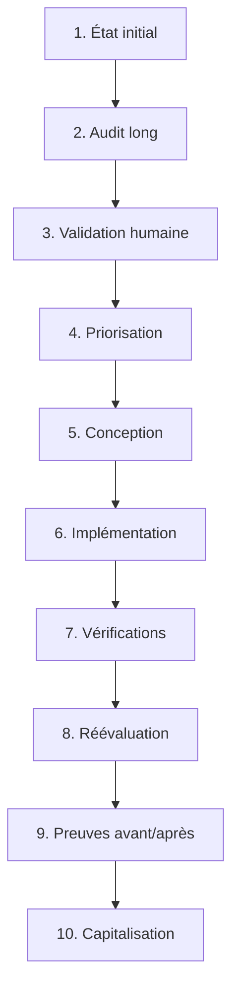

# Démarche de réappropriabilité des prototypes

## Statut du document

- **Nature** : protocole méthodologique transversal
- **Périmètre** : prototypes d’IC-Lab-Next
- **Document complémentaire** : `GRILLE_CRITIQUE_REAPPROPRIABILITE.md`
- **Première application** : Proto05 — vidéo augmentée
- **Date de création** : 26 juillet 2026
- **Statut** : version de travail appelée à évoluer après chaque application

## Finalité

Ce document décrit la démarche commune utilisée pour examiner puis consolider la réappropriabilité des prototypes d’IC-Lab-Next.

La grille critique définit **ce qui doit être observé**. La présente démarche définit **comment conduire le cycle complet**, depuis la conservation d’un état initial jusqu’à la production de preuves avant/après et à l’analyse transversale des résultats.

L’objectif n’est pas de transformer chaque prototype en service institutionnel achevé. Il est de déterminer, de manière argumentée et vérifiable, dans quelle mesure :

1. les ressources pédagogiques produites ou gérées peuvent être comprises, retrouvées, utilisées, adaptées et transmises par d’autres acteurs ;
2. les prototypes logiciels eux-mêmes peuvent être compris, lancés, maintenus et développés sans dépendre continuellement de leur concepteur ;
3. des transformations raisonnables peuvent réduire les dépendances les plus importantes ;
4. ces transformations produisent un gain observable, sans dégrader l’intention pédagogique ni ajouter un travail disproportionné.

La démarche doit notamment permettre de tester le « miroir » formulé dans le mémoire :

> Les prototypes développés pour résoudre la dispersion et la fragilité des ressources risquent-ils eux-mêmes de demeurer dépendants de leur concepteur, insuffisamment documentés, difficiles à maintenir ou disponibles sans être réellement reprenables ?

## Ensemble documentaire

La démarche repose sur trois niveaux complémentaires.

| Niveau | Document | Fonction |
|---|---|---|
| Référentiel | `GRILLE_CRITIQUE_REAPPROPRIABILITE.md` | Définir les dimensions et critères à examiner |
| Protocole | `DEMARCHE_REAPPROPRIABILITE_PROTOTYPES.md` | Définir le cycle commun d’évaluation et de consolidation |
| Traces | Rapports numérotés dans `reports` | Conserver les constats, preuves, décisions, transformations et limites propres à chaque prototype |

Ces documents ne doivent pas se substituer les uns aux autres :

- la grille ne décrit pas le déroulement opérationnel d’une mission ;
- la démarche ne contient pas tous les constats détaillés de chaque prototype ;
- les rapports ne doivent pas réinventer la méthode à chaque application.

## Principes directeurs

### 1. Distinguer deux objets de réappropriation

Chaque audit distingue obligatoirement :

#### A. La ressource pédagogique

Il s’agit de ce que le prototype permet de retrouver, consulter, produire, modifier, dériver ou transmettre : activité, scénario, média, annotation, consigne, transcription, traitement, métadonnées, documentation pédagogique ou assemblage de ces éléments.

La question principale est :

> Un autre enseignant peut-il comprendre la ressource, déterminer à quoi elle sert, retrouver ses composants, l’utiliser, l’adapter et la transmettre sans dépendre continuellement de son concepteur ?

#### B. Le prototype logiciel

Il s’agit de l’application, de ses données, de son architecture, de ses dépendances, de ses tests, de sa documentation et de ses procédures d’exploitation ou de maintenance.

La question principale est :

> Un tiers compétent peut-il comprendre le rôle du prototype, le lancer, identifier ses sources de vérité, le maintenir, le diagnostiquer et le faire évoluer sans connaissance orale indispensable ?

Un même critère peut produire deux constats différents. Une ressource peut être pédagogiquement intelligible dans un prototype techniquement fragile ; inversement, un prototype peut être robuste et testé tout en gérant des ressources pédagogiquement opaques.

### 2. Conserver l’état initial avant de corriger

L’audit doit précéder la consolidation.

Avant toute transformation importante, il faut conserver :

- la date de l’état observé ;
- le commit ou l’état Git de référence ;
- la version du prototype ;
- les routes, écrans et documents réellement actifs ;
- les données ou exemples examinés ;
- les tests exécutés ;
- les captures utiles ;
- les limites de l’observation.

Cette conservation évite de reconstruire après coup un « avant » approximatif. Elle constitue la base de la comparaison historique et des preuves présentées dans le mémoire, sur le site ou pendant la soutenance.

### 3. Ne pas confondre présence et réappropriabilité

Une fonctionnalité présente n’est pas automatiquement réappropriable.

Pour être considérée comme consolidée, elle doit aussi être :

- visible ou retrouvable ;
- compréhensible par l’acteur concerné ;
- documentée au niveau nécessaire ;
- utilisable dans des conditions réalistes ;
- compatible avec ses pratiques et ses moyens ;
- suffisamment stable ou récupérable ;
- étayée par des preuves adaptées.

Réciproquement, une absence de preuve ne prouve pas automatiquement une absence de fonctionnalité.

Chaque constat doit distinguer :

| État | Signification |
|---|---|
| **Absent** | L’élément recherché n’existe pas dans le périmètre observé |
| **Non documenté** | L’élément existe, mais son fonctionnement, son rôle ou son usage n’est pas expliqué de manière suffisante |
| **Non vérifiable** | Les preuves accessibles ne permettent pas de confirmer ou d’infirmer le constat |
| **Inconnu** | L’information n’est actuellement pas connue des acteurs |
| **À vérifier** | L’information pourrait être établie, mais une vérification reste nécessaire |
| **Non applicable** | Le critère n’a pas de sens pour l’objet ou le contexte considéré |

### 4. Ne pas attribuer de note globale

La démarche ne produit ni pourcentage synthétique ni note unique.

Une note globale masquerait :

- la différence entre ressource et logiciel ;
- les écarts entre dimensions pédagogiques, documentaires, techniques, juridiques et organisationnelles ;
- la différence entre une fragilité locale et une dépendance structurelle ;
- la qualité variable des preuves ;
- les arbitrages propres aux acteurs et au contexte.

La comparaison repose sur des profils qualitatifs, des preuves situées et des évolutions explicites.

### 5. Ne pas accepter l’audit comme parole définitive

Un rapport d’audit est une proposition argumentée, pas un verdict automatique.

Après chaque audit, une validation humaine doit distinguer :

- ce qui est réellement absent ;
- ce qui existe mais demeure invisible ;
- ce qui est présent mais insuffisamment documenté ;
- ce que l’auditeur n’a simplement pas retrouvé ;
- ce qui relève d’une fragilité structurelle ;
- ce qui relève d’un polissage de l’interface ;
- ce qui serait souhaitable pour un service institutionnel, mais disproportionné pour un prototype ;
- ce qui doit être traité pendant la période disponible ;
- ce qui doit rester une limite explicitement assumée.

Les désaccords avec l’audit doivent être documentés. Ils peuvent révéler une faiblesse de la grille, une ambiguïté du prototype ou une connaissance encore trop implicite.

### 6. Améliorer aussi la grille

L’application de la grille à plusieurs objets doit permettre de tester la grille elle-même.

Après chaque prototype, il faut relever :

- les critères redondants ;
- les formulations trop abstraites ;
- les critères impossibles à prouver ;
- les dimensions manquantes ;
- les différences d’interprétation ;
- les niveaux de preuve insuffisamment définis ;
- les critères trop institutionnels pour le périmètre étudié.

Toute évolution substantielle de la grille doit être datée et justifiée afin de préserver la comparabilité des audits.

## Cycle canonique

Le cycle comporte dix étapes. Certaines peuvent être regroupées dans une même journée, mais leur ordre logique doit être préservé.

## Étape 1 — Figer et décrire l’état initial

### Objectif

Créer un point de référence daté avant toute correction motivée par l’audit.

### Actions

1. Vérifier l’état Git.
2. Identifier le commit et la version observés.
3. Lire les instructions applicables au dépôt.
4. identifier les documents présentés comme canoniques.
5. Vérifier leur actualité réelle.
6. Identifier les données canoniques et les exemples significatifs.
7. Repérer les routes, écrans et fonctions actives.
8. Relever les tests existants.
9. Conserver les captures nécessaires.
10. Signaler les modifications locales préexistantes.

### Livrables minimaux

- référence Git ;
- date ;
- version ;
- périmètre ;
- liste des preuves principales ;
- limites connues.

### Vigilance

Un dépôt riche en rapports historiques peut demeurer difficile à reprendre si aucun document d’entrée ne permet de déterminer rapidement ce qui est encore vrai. La conservation de l’histoire ne suffit pas à garantir la disponibilité de l’information pour l’action.

## Étape 2 — Réaliser l’audit critique long

### Objectif

Appliquer intégralement la grille à l’état initial, sans corriger le prototype pendant l’observation.

### Règles

- distinguer la ressource pédagogique et le prototype logiciel ;
- appliquer le socle pédagogique, les conditions de réappropriation, les arbitrages finaux et le protocole de preuve ;
- examiner les preuves favorables et les contre-preuves ;
- distinguer fonctionnement déclaré, inspection statique, test automatisé, recette technique et usage humain observé ;
- ne pas transformer l’audit en roadmap exhaustive ;
- ne pas confondre amélioration fonctionnelle et amélioration de la réappropriabilité ;
- signaler explicitement ce qui n’a pas été testé.

### Contenu attendu

Le rapport doit au minimum présenter :

- un résumé exécutif ;
- le périmètre et la méthode ;
- l’état canonique réellement observé ;
- la grille complétée ;
- les preuves et leur niveau ;
- les forces consolidées ;
- les fragilités et dépendances ;
- les éléments absents, non documentés ou non vérifiables ;
- le travail évité et le travail ajouté par le prototype ;
- les risques de dégradation de l’intention pédagogique ;
- la compatibilité avec les pratiques et moyens des acteurs ;
- une première comparaison historique ;
- une critique de la grille ;
- une réponse explicite au test du miroir.

## Étape 3 — Valider humainement le diagnostic

### Objectif

Transformer le rapport brut en diagnostic partagé.

### Questions de validation

Pour chaque fragilité importante :

1. Le constat est-il factuellement exact ?
2. La preuve est-elle suffisante ?
3. L’élément est-il absent, invisible, obsolète, non documenté ou non vérifiable ?
4. Le problème concerne-t-il la ressource, le logiciel ou les deux ?
5. La dépendance observée est-elle réellement problématique dans le contexte du prototype ?
6. S’agit-il d’une condition minimale de reprise ou d’une exigence de changement d’échelle institutionnel ?
7. Une intervention sur ce point améliorerait-elle réellement l’autonomie d’un tiers ?
8. Le gain pourrait-il être constaté et documenté ?

### Résultat attendu

Chaque constat important reçoit l’une des orientations suivantes :

- **à consolider maintenant** ;
- **à étudier avant décision** ;
- **à observer auprès d’un tiers** ;
- **à documenter comme limite** ;
- **hors périmètre actuel** ;
- **constat à corriger ou nuancer**.

## Étape 4 — Choisir des priorités à fort effet

### Objectif

Sélectionner un petit nombre de transformations proportionnées.

Les priorités sont choisies selon quatre axes :

| Axe | Question |
|---|---|
| **Impact** | La transformation réduit-elle une dépendance ou une fragilité importante ? |
| **Visibilité** | Le gain devient-il perceptible pour l’acteur concerné ou démontrable pendant la soutenance ? |
| **Effort** | Le coût est-il raisonnable au regard du temps disponible et du niveau de maturité du prototype ? |
| **Force de la preuve** | Pourra-t-on établir clairement un avant/après ou observer une reprise plus autonome ? |

Une priorité très favorable combine :

- un impact important ;
- une visibilité claire ;
- un effort faible ou modéré ;
- une preuve avant/après forte.

### Catégories de priorité

- **Bloquante** : empêche la compréhension, l’usage, l’adaptation, la transmission ou la maintenance dans le périmètre visé.
- **Importante** : réduit fortement l’autonomie ou augmente sensiblement le risque.
- **Utile mais non prioritaire** : améliore la qualité sans conditionner la reprise.
- **À observer** : ne peut être tranchée sans enseignant, mainteneur ou autre tiers.
- **Changement d’échelle** : pertinente pour un service durable ou institutionnel, mais non exigible immédiatement du prototype.

### Garde-fous

La priorisation ne doit pas :

- récompenser uniquement les changements spectaculaires à l’écran ;
- réduire la réappropriabilité à l’UX ;
- imposer une refonte générale ;
- faire passer toutes les recommandations de l’audit au statut de tickets ;
- effacer la photographie initiale avant qu’elle soit correctement conservée.

## Étape 5 — Conduire un audit de conception si nécessaire

### Objectif

Étudier l’insertion minimale d’une transformation avant de modifier le modèle, les données ou l’architecture.

Cette étape est nécessaire lorsque la priorité implique :

- un nouvel objet canonique ;
- de nouvelles métadonnées ;
- une relation de filiation ;
- une migration ;
- un vocabulaire contrôlé ;
- une modification partagée par plusieurs vues ;
- une évolution des règles de validation ;
- un risque de duplication ou de contradiction.

### Questions à traiter

1. Quel besoin précis tiré de l’audit est traité ?
2. L’information existe-t-elle déjà ailleurs ?
3. Quelle est sa source de vérité ?
4. Doit-elle être structurée ou rester libre ?
5. Est-elle obligatoire, facultative, inconnue, à vérifier ou non applicable ?
6. Comment préserver les objets existants ?
7. Quel est le périmètre minimal visible ?
8. Quels invariants doivent être testés ?
9. Quelles décisions ne peuvent pas être déduites du dépôt ?
10. Quelles informations doivent être demandées à David ou à un acteur métier ?

### Principe

L’audit de conception doit réduire l’incertitude, pas produire une architecture idéale disproportionnée.

Il doit se terminer par :

- une recommandation de type **go**, **go sous conditions** ou **no-go** ;
- un périmètre borné d’implémentation ;
- la liste probable des fichiers concernés ;
- les questions humaines restant à résoudre ;
- les risques de sur-conception.

## Étape 6 — Réaliser une implémentation bornée

### Objectif

Produire le gain ciblé sans transformer la mission en réécriture générale du prototype.

### Exigences

- partir du diagnostic validé ;
- respecter les sources de vérité existantes ;
- préserver les données et les originaux ;
- gérer explicitement la compatibilité ;
- ne pas inventer d’informations pédagogiques ou juridiques ;
- limiter les migrations au strict nécessaire ;
- documenter les décisions irréversibles ;
- ajouter ou adapter les tests protégeant les invariants ;
- ne pas masquer une donnée inconnue sous une valeur vraisemblable ;
- conserver la possibilité de revenir à l’état antérieur par Git ou sauvegarde adaptée.

### Découpage recommandé

Une transformation importante peut être scindée en missions distinctes :

1. modèle ou contrat ;
2. migration ou compatibilité ;
3. interface ;
4. qualification des données ;
5. tests et documentation ;
6. recette et réévaluation.

Ce découpage n’est pas obligatoire. Il sert à maintenir des périmètres vérifiables et à éviter qu’une mission unique mélange conception, migration, interface et validation pédagogique.

## Étape 7 — Vérifier techniquement et humainement

### Objectif

Établir ce que la transformation prouve réellement.

### Niveaux de vérification

| Vérification | Ce qu’elle peut établir | Ce qu’elle ne suffit pas à établir |
|---|---|---|
| Inspection du code | Existence d’un mécanisme, responsabilités, chemins de données | Compréhension réelle ou facilité d’usage |
| Test automatisé | Respect d’un contrat explicite et reproductible | Pertinence pédagogique ou autonomie humaine globale |
| Recette technique | Fonctionnement réel dans un environnement donné | Reprise autonome par un tiers |
| Recette visuelle par David | Cohérence de l’interface et conformité à l’intention attendue | Compréhension d’un nouvel utilisateur |
| Reprise par un enseignant | Compréhension et usage dans un contexte pédagogique | Maintenabilité technique |
| Reprise par un mainteneur | Installation, diagnostic et évolution du logiciel | Pertinence de la ressource pour les enseignants |

Les preuves doivent être nommées correctement. Une inspection statique ne doit pas être présentée comme un usage observé. Un test automatisé réussi ne prouve pas qu’un enseignant comprend le vocabulaire ou le scénario.

### Recette minimale

Après une transformation visible :

1. vérifier le parcours principal ;
2. vérifier les états incomplets ou inconnus ;
3. vérifier la compatibilité des objets historiques ;
4. vérifier l’absence de perte de données ;
5. vérifier les erreurs et possibilités de récupération ;
6. vérifier l’affichage sur les vues concernées ;
7. consigner ce qui reste non testé.

## Étape 8 — Réévaluer avec la grille courte

### Objectif

Mesurer qualitativement le gain produit, sans refaire systématiquement l’intégralité de l’audit long.

La réévaluation courte doit répondre au minimum aux questions suivantes :

1. Un tiers comprend-il mieux ce qu’est l’objet et à quoi il sert ?
2. Peut-il le retrouver et identifier ses composants ?
3. Peut-il déterminer ce qui est fiable, incomplet, inconnu ou à vérifier ?
4. Peut-il l’utiliser sans connaissance orale essentielle ?
5. Peut-il l’adapter sans détruire son cœur pédagogique ou ses données ?
6. Peut-il comprendre son origine, ses variantes et ses dépendances ?
7. Peut-il le transmettre ou le maintenir dans les limites annoncées ?
8. Le gain réduit-il réellement la dépendance au concepteur ?

Pour chaque question, la réévaluation doit indiquer :

- l’état avant ;
- la transformation réalisée ;
- l’état après ;
- les preuves ;
- les limites ;
- les validations humaines encore nécessaires.

Un champ nouvellement ajouté, un écran plus complet ou un test supplémentaire ne constitue pas à lui seul un gain consolidé. Le gain dépend aussi de la qualité des informations renseignées et de leur compréhension par les acteurs.

## Étape 9 — Constituer les preuves avant/après

### Objectif

Rendre la transformation démontrable et réutilisable dans l’analyse du mémoire, le site et la soutenance.

### Preuves possibles

- commits de référence ;
- rapports d’audit et de conception ;
- captures comparables ;
- extraits de données ou de schémas ;
- tests ajoutés ou corrigés ;
- documents canoniques avant/après ;
- chronologie des décisions ;
- résultats d’une recette ;
- observations d’enseignants ;
- compte rendu de reprise par un mainteneur ;
- exemples de travail évité ou ajouté.

### Fiche de preuve

Pour chaque transformation importante, conserver :

| Élément | Contenu |
|---|---|
| Prototype | Nom et version |
| Fragilité initiale | Constat précis |
| Preuve initiale | Fichier, écran, test, donnée, rapport ou observation |
| Décision | Transformation choisie et justification |
| Périmètre | Ce qui a été modifié et ce qui ne l’a pas été |
| Preuve finale | Élément comparable à la preuve initiale |
| Gain établi | Ce qui peut être affirmé |
| Gain supposé | Ce qui reste à observer |
| Travail ajouté | Nouvelles contraintes ou tâches |
| Limites | Fragilités persistantes |

### Sélection pour la soutenance

Une bonne preuve de soutenance doit être :

- compréhensible rapidement ;
- directement reliée à un critère de la grille ;
- appuyée par un avant/après comparable ;
- honnête sur ses limites ;
- représentative d’un apprentissage transférable à d’autres prototypes.

## Étape 10 — Capitaliser dans le mémoire et la démarche

### Objectif

Ne pas limiter la consolidation à une succession de correctifs locaux.

Après chaque cycle, il faut produire quatre niveaux d’enseignement :

1. **Enseignement propre au prototype** : fragilités et transformations spécifiques.
2. **Enseignement transversal** : motif récurrent entre plusieurs prototypes.
3. **Enseignement méthodologique** : amélioration possible de la grille ou de la démarche.
4. **Enseignement pour le mémoire** : relation entre ingénierie, réappropriation, adaptation, dispersion, fragilité et dépendance au concepteur.

### Questions de capitalisation

- Qu’est-ce que le prototype rend réellement plus facile ?
- Quel travail déplace-t-il ou ajoute-t-il ?
- Que préserve-t-il mieux : les fichiers, les filiations, le scénario, le contexte, les droits ou la continuité humaine ?
- Quelle connaissance reste implicite ?
- Quelles fragilités sont communes à plusieurs prototypes ?
- Quelles solutions sont transférables ?
- Quels critères de la grille se sont révélés les plus discriminants ?
- Quels gains ne pourront être établis qu’avec des acteurs tiers ?

## Protocole de preuve

### Hiérarchie indicative

Le niveau de preuve doit suivre le protocole défini dans la grille. Dans la démarche opérationnelle, les distinctions suivantes doivent rester visibles :

1. **Déclaration** : affirmation portée par un document ou un acteur sans vérification supplémentaire.
2. **Inspection** : élément retrouvé dans les fichiers, le code, les données ou l’historique.
3. **Test automatisé** : contrat exécuté de manière reproductible.
4. **Recette réelle** : fonctionnement observé dans l’application.
5. **Usage par l’acteur concerné** : réalisation d’une tâche par un enseignant, un mainteneur ou un autre tiers.
6. **Reprise autonome dans la durée** : usage, adaptation, transmission ou maintenance sans assistance essentielle du concepteur.

Ces niveaux ne forment pas une simple échelle où le niveau supérieur annulerait les précédents. Ils prouvent des dimensions différentes et doivent souvent être combinés.

### Contre-preuves

Une preuve favorable doit être confrontée aux éléments susceptibles de la nuancer :

- documentation contradictoire ;
- test obsolète ;
- route historique encore exposée ;
- donnée manquante ;
- dépendance non déclarée ;
- fonctionnement limité à un environnement préparé ;
- champ présent mais non renseigné ;
- ressource accessible mais juridiquement non transmissible ;
- fonctionnalité disponible mais incompréhensible sans explication orale.

### Cohérence entre sources

Chaque audit doit rechercher la cohérence entre :

- documentation ;
- données ;
- code ;
- interface ;
- tests ;
- historique des décisions ;
- pratiques réellement observées.

La présence de ces différentes sources ne garantit pas leur cohérence. Une contradiction entre elles constitue une fragilité propre, même lorsque le fonctionnement principal est correct.

## Répartition des rôles

| Acteur | Responsabilités principales |
|---|---|
| **David** | Valider l’intention pédagogique, arbitrer le périmètre, qualifier les informations non déductibles, réaliser la recette visuelle, organiser si possible les observations tierces |
| **GPT / Work** | Formuler et maintenir la démarche, lire critiquement les rapports, hiérarchiser les constats, comparer les prototypes, relier les résultats au mémoire et à la soutenance |
| **Codex** | Inspecter le dépôt, retrouver les preuves, analyser l’historique, exécuter les contrôles autorisés, produire les audits de conception et réaliser les implémentations bornées |
| **Enseignant tiers** | Tester la compréhension, la retrouvabilité, l’usage, l’adaptation et la transmission des ressources |
| **Mainteneur tiers** | Tester l’installation, la compréhension de l’architecture, le diagnostic, la restauration et l’évolution du logiciel |

Aucun acteur ne peut à lui seul établir toutes les dimensions de la réappropriabilité.

En particulier :

- David connaît l’intention, mais sa propre maîtrise peut masquer les obstacles rencontrés par un nouvel utilisateur ;
- Codex peut inspecter et tester, mais ne remplace pas l’usage réel d’un enseignant ;
- un enseignant peut valider l’utilité pédagogique sans pouvoir juger la maintenabilité technique ;
- un mainteneur peut reprendre le logiciel sans pouvoir confirmer la qualité du scénario.

## Organisation temporelle proposée

Pendant la période de consolidation :

- les jours principalement consacrés aux fonctionnalités peuvent continuer à faire évoluer les prototypes ;
- un temps régulier, notamment le dimanche, peut être réservé aux audits, arbitrages, consolidations et preuves ;
- toute nouvelle fonctionnalité importante doit être examinée à la lumière du prochain audit, sans pour autant imposer un audit complet après chaque commit ;
- la photographie initiale de chaque prototype doit être conservée avant sa première consolidation guidée par la grille.

Un cycle hebdomadaire possible est :

| Moment | Activité |
|---|---|
| Début de cycle | Choix du prototype et conservation de l’état initial |
| Audit | Application de la grille longue |
| Discussion | Validation humaine et sélection d’une priorité |
| Conception | Audit ciblé si une décision de modèle est nécessaire |
| Développement | Implémentation bornée |
| Vérification | Tests, recette et collecte des preuves |
| Clôture | Grille courte, mise à jour du suivi transversal et enseignements pour le mémoire |

Le cycle peut dépasser une semaine. La régularité méthodologique compte davantage que la cadence.

## Nommage des rapports

Les rapports restent numérotés selon l’ordre des missions du dépôt.

Suffixes recommandés :

- `critical_reappropriability_audit` : audit critique long ;
- `reappropriability_design` ou suffixe métier précis : audit de conception ;
- `reappropriability_implementation` ou suffixe métier précis : transformation ;
- `reappropriability_reassessment` : réévaluation courte ;
- `third_party_reappropriation_test` : observation par un tiers ;
- `reappropriability_cross_analysis` : comparaison transversale.

Le titre doit rester suffisamment précis pour identifier le prototype et la nature de la mission.

## Dossier minimal de chaque prototype

Pour qu’un cycle soit exploitable ultérieurement, il doit être possible de retrouver :

- l’état Git initial ;
- l’audit long ;
- la validation ou synthèse humaine ;
- la priorité retenue ;
- l’éventuel audit de conception ;
- le ou les commits de transformation ;
- les contrôles et recettes ;
- la réévaluation courte ;
- les preuves avant/après ;
- les limites persistantes ;
- les observations tierces, si elles existent.

Ces éléments peuvent être répartis dans plusieurs rapports et commits. Il n’est pas nécessaire de créer un fichier supplémentaire pour chacun lorsque la trace est déjà claire et durable.

## Suivi transversal

Le tableau suivant conserve une vue synthétique. Les rapports détaillés demeurent les sources de preuve.

| Prototype | État initial | Audit long | Priorité retenue | Transformation | Réévaluation | Preuve tierce | Statut |
|---|---|---|---|---|---|---|---|
| Proto05 — vidéo augmentée | 26/07/2026 ; version 0.1.40 ; état audité après `ac77bcf` | Rapport 118 | Identité pédagogique canonique et reprise de l’activité historique | Mission 120 — identité pédagogique minimale implémentée en 0.1.41 | À réaliser par David | À organiser | Cycle en cours |
| Prototype à sélectionner | — | — | — | — | — | — | Non commencé |
| Prototype à sélectionner | — | — | — | — | — | — | Non commencé |
| Prototype à sélectionner | — | — | — | — | — | — | Non commencé |
| Prototype à sélectionner | — | — | — | — | — | — | Non commencé |

Ce tableau doit rester synthétique. Une cellule ne doit pas contenir un diagnostic complet.

## Première application : enseignements initiaux de Proto05

L’audit 118 constitue la première application complète de la grille et le premier état de référence de la démarche.

Il fait apparaître plusieurs enseignements structurants :

### 1. Solidité technique et reprise pédagogique peuvent diverger

Proto05 présente une reprise technique partielle à forte, portée notamment par ses modèles, ses tests, ses mécanismes de sauvegarde et sa traçabilité. Sa reprise pédagogique demeure plus fragile, car un tiers ne dispose pas toujours des informations lui permettant de comprendre l’intention, le public, le contexte, les prérequis, les marges d’adaptation ou la transmissibilité des activités.

### 2. La filiation des médias peut être mieux préservée que celle des scénarios

Le modèle des médias distingue et relie les assets, sources, playables, originaux, dérivés et traitements. La filiation pédagogique entre activités sources et variantes reste moins consolidée.

Ce décalage montre qu’une infrastructure peut préserver précisément l’histoire technique d’un média sans préserver avec la même force l’histoire pédagogique de son usage.

### 3. La conservation documentaire ne garantit pas une documentation actionnable

Les nombreux rapports conservent une grande partie de l’histoire du prototype. Cependant, plusieurs documents d’entrée peuvent devenir contradictoires ou obsolètes. Un tiers doit alors reconstituer l’état actuel par enquête.

Le prototype destiné à réduire la dispersion des ressources peut donc reproduire une forme de dispersion dans sa propre documentation.

### 4. Les tests peuvent révéler des décisions désynchronisées

L’échec d’un test Chromium obsolète pendant l’audit a montré une divergence entre un ancien contrat d’interface et une décision plus récente. Il ne signalait pas nécessairement un dysfonctionnement de l’application, mais une incohérence entre code, test et décision actuelle.

Cet exemple justifie l’examen explicite de la cohérence entre documentation, données, code, interface et tests.

### 5. La présence de métadonnées ne suffit pas

Ajouter une identité pédagogique canonique peut améliorer la compréhension, la qualification et la transmission des activités. Toutefois, le gain ne sera réel que si :

- les champs sont adaptés aux besoins ;
- les valeurs inconnues ou à vérifier sont assumées ;
- les informations sont effectivement renseignées ;
- elles sont visibles au bon endroit ;
- elles sont comprises par un enseignant tiers.

### 6. Certaines recommandations relèvent du changement d’échelle

La gouvernance institutionnelle, l’authentification, les niveaux de service, la suppléance durable, le financement ou l’animation d’une communauté peuvent être nécessaires à un service pérenne. Leur absence ne doit pas automatiquement devenir une priorité immédiate pour un prototype local de stage.

Ces dimensions doivent être conservées comme conditions ou limites d’un changement d’échelle.

## Questions transversales à comparer entre prototypes

À mesure des applications, la comparaison devra notamment examiner :

1. Où se situe la principale dépendance au concepteur ?
2. Qu’est-ce qui est le mieux préservé : fichiers, données, scénario, filiation, contexte, droits ou procédures ?
3. Le prototype rend-il les ressources seulement disponibles ou réellement reprenables ?
4. La retrouvabilité concerne-t-elle les objets techniques, les intentions pédagogiques ou les deux ?
5. L’adaptation est-elle permise, guidée, traçable et réversible ?
6. Quels coûts nouveaux le prototype impose-t-il aux enseignants ?
7. Quelles dépendances techniques limitent la transmission ?
8. Quels éléments reposent encore sur une explication orale de David ?
9. Quels gains peuvent être obtenus avec un effort modéré ?
10. Quels gains nécessitent un changement d’échelle ?
11. Quelles transformations sont transférables d’un prototype à l’autre ?
12. Quelles fragilités persistent malgré une forte qualité technique ?

## Risques méthodologiques

### Transformer la démarche en liste de défauts

L’audit doit aussi identifier les forces consolidées, le travail évité et les éléments déjà reprenables.

### Sur-concevoir

La volonté de renseigner tous les contextes possibles peut conduire à des modèles trop lourds, des formulaires décourageants ou une architecture disproportionnée.

### Confondre documentation et autonomie

Une documentation complète peut rester inutilisable. L’autonomie doit être observée autant que possible.

### Confondre visibilité et importance

Une amélioration spectaculaire à l’écran n’est pas forcément la transformation la plus structurante.

### Inventer les informations manquantes

Une donnée plausible ne doit jamais remplacer une information inconnue, particulièrement pour l’intention pédagogique, les droits, l’origine ou le contexte.

### Corriger avant d’observer

Une amélioration prématurée peut détruire la possibilité de constituer une preuve initiale fiable.

### Généraliser à partir d’un seul prototype

Proto05 sert de première application, non de modèle universel. La démarche doit être ajustée après confrontation à des prototypes de nature différente.

### Confondre absence de preuve et échec

Certaines dimensions ne pourront être établies qu’après une observation auprès d’enseignants ou de mainteneurs tiers.

## Critères d’arrêt d’un cycle

Un cycle peut être considéré comme suffisamment documenté lorsque :

- l’état initial est identifiable ;
- l’audit long a été discuté et validé ;
- une priorité explicite a été choisie ou l’absence de transformation a été justifiée ;
- l’implémentation éventuelle est bornée et vérifiée ;
- l’état après est identifiable ;
- les gains établis et supposés sont distingués ;
- les limites persistantes sont consignées ;
- le suivi transversal est mis à jour ;
- au moins un enseignement pour le mémoire ou pour la méthode est formulé.

Un cycle n’exige pas que toutes les fragilités soient corrigées.

## Checklist opérationnelle

### Avant l’audit

- [ ] État Git vérifié
- [ ] État initial et version consignés
- [ ] Documents d’instructions lus
- [ ] Sources de vérité identifiées
- [ ] Données et exemples représentatifs identifiés
- [ ] Captures initiales conservées si utiles
- [ ] Périmètre et interdictions définis

### Pendant l’audit

- [ ] Ressource et logiciel distingués
- [ ] Grille complète appliquée
- [ ] Preuves et contre-preuves recherchées
- [ ] Absent, non documenté, non vérifiable et inconnu distingués
- [ ] Tests et inspections nommés correctement
- [ ] Histoire Git examinée sans modification destructive
- [ ] Limites de preuve explicitées
- [ ] Grille elle-même critiquée

### Après l’audit

- [ ] Rapport relu critiquement
- [ ] Constats erronés ou excessifs corrigés
- [ ] Fragilités locales et changement d’échelle distingués
- [ ] Priorités classées
- [ ] Transformation à fort effet sélectionnée
- [ ] État initial durablement conservé

### Avant l’implémentation

- [ ] Besoin relié à un constat prouvé
- [ ] Audit de conception réalisé si nécessaire
- [ ] Source de vérité définie
- [ ] Compatibilité prévue
- [ ] Informations humaines à demander identifiées
- [ ] Périmètre borné
- [ ] Invariants et tests prévus

### Après l’implémentation

- [ ] Tests techniques exécutés
- [ ] Recette visuelle réalisée
- [ ] Données et originaux préservés
- [ ] États incomplets ou inconnus vérifiés
- [ ] Réévaluation courte réalisée
- [ ] Preuves avant/après conservées
- [ ] Gains établis et supposés distingués
- [ ] Travail ajouté analysé
- [ ] Limites persistantes consignées
- [ ] Suivi transversal mis à jour
- [ ] Enseignements intégrables au mémoire relevés

## Évolution du présent document

Ce protocole est volontairement évolutif.

Après chaque application :

1. mettre à jour le tableau transversal ;
2. ajouter uniquement les enseignements méthodologiques réellement nouveaux ;
3. éviter d’y recopier les constats détaillés des rapports ;
4. dater toute modification substantielle du cycle ou du protocole de preuve ;
5. vérifier que les évolutions n’empêchent pas de comparer les prototypes déjà audités ;
6. conserver les désaccords importants lorsqu’ils éclairent les limites de la méthode.

L’objectif final n’est pas d’obtenir un protocole théorique parfait, mais une démarche suffisamment stable, explicite et éprouvée pour :

- guider les consolidations pendant les semaines restantes ;
- comparer plusieurs prototypes sans effacer leurs différences ;
- documenter des transformations réelles ;
- soutenir l’argumentation du mémoire ;
- produire des démonstrations honnêtes et lisibles pour la soutenance ;
- réduire progressivement la dépendance des ressources et des logiciels à leur concepteur.

## Conclusion

La réappropriabilité ne constitue pas une couche de finition appliquée après le développement. Elle oblige à examiner simultanément l’intention pédagogique, l’information disponible, les possibilités d’adaptation, les filiations, les dépendances techniques, la continuité humaine et les conditions réelles d’usage.

La démarche retenue suit donc un cycle expérimental :

> observer sans corriger, établir les preuves, discuter le diagnostic, choisir une transformation proportionnée, la concevoir, l’implémenter, la vérifier, puis comparer l’état obtenu à l’état initial.

Ce cycle ne vise pas à éliminer toute fragilité. Il vise à rendre visibles les dépendances, à réduire celles qui comptent réellement et à établir précisément ce qui devient plus compréhensible, plus retrouvable, plus adaptable, plus transmissible ou plus maintenable.

Appliqué successivement aux prototypes d’IC-Lab-Next, il doit permettre de répondre non seulement à la question « les prototypes fonctionnent-ils ? », mais à une question plus exigeante :

> Que faut-il préserver, expliciter et transformer pour que ce qu’ils produisent puisse réellement continuer à vivre entre les mains d’autres acteurs ?
