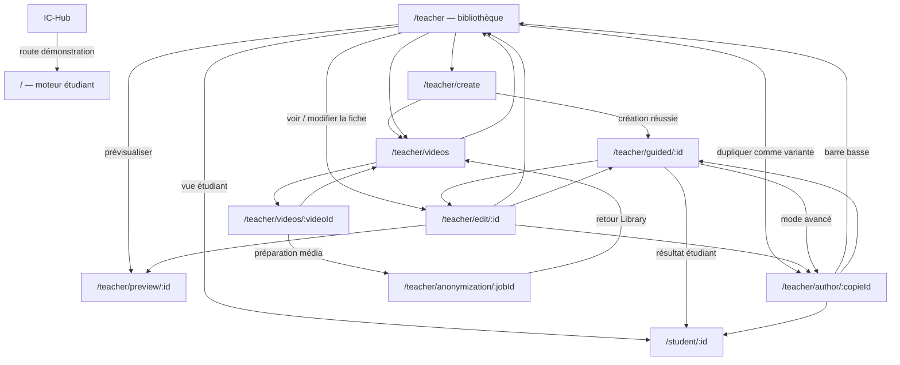

# Mission 122 — Audit de la navigation enseignante de Proto05

Date : 2026-07-26  
Nature : audit documentaire et proposition de conception  
Périmètre : interfaces enseignantes de Proto05 uniquement

## 1. Résultat synthétique

Proto05 possède bien tous les espaces nécessaires au travail enseignant, mais
ils ne forment pas encore un système de navigation commun. Les écrans actifs
sont accessibles par des liens locaux, souvent propres à chaque page. Il n'y a
ni en-tête général partagé, ni repère d'activité partagé, ni retour vers
IC-Hub depuis l'interface enseignante.

La recommandation est un seul en-tête enseignant compact, composé de deux
niveaux dans un même conteneur :

1. une navigation générale toujours visible dans les écrans enseignants :
   **Vidéo augmentée**, **Bibliothèque**, **Nouvelle activité**,
   **Vidéothèque**, **IC-Hub** ;
2. une navigation contextuelle, affichée seulement lorsqu'une activité est
   ouverte : **Fiche pédagogique**, **Atelier guidé**,
   **Atelier auteur · mode expert**, **Prévisualisation étudiante**.

Sur les pages longues d'édition, ce conteneur devient collant et reçoit à
droite l'action **Enregistrer** et son état. Il ne faut pas empiler une barre
générale, une barre d'activité et une barre d'actions indépendantes.

L'atelier auteur est un écran actif et utile pour le travail expert de David.
Il doit rester directement accessible, mais être qualifié explicitement de
**mode expert**. L'atelier guidé demeure l'entrée principale à proposer à un
enseignant comme Christian. L'ancien atelier d'anonymisation avancé est, lui,
retiré et inaccessible ; il ne doit pas être confondu avec l'atelier auteur.

Aucun fichier applicatif, style, contrat de données, donnée ou numéro de
version n'a été modifié au cours de cette mission.

## 2. État initial

- Branche : `main`
- Relation au distant : `main...origin/main [ahead 5]`
- Arbre de travail initial : propre
- Commit observé :
  `1f5c9a7e847319527213217df14edcb56abeedb9`
- Intitulé du commit :
  `fix(proto05): harmonize pedagogical identity input states`
- Date du commit : `2026-07-26 18:06:54 +0200`
- Version applicative canonique de Proto05 : `0.1.42`
  (`server/package.json` et constante `VERSION` de `server/server.js`)
- Artefact étudiant servi : `index-0.0.9.html`

Une mention `Proto05 · 0.1.40` subsiste dans
`teacher-video-detail.html`. C'est un libellé d'interface ancien, et non la
source de vérité de version. Il n'a pas été corrigé, cette mission interdisant
toute modification applicative.

## 3. Sources et méthode

### Instructions et documentation actuelle

- `AGENTS.md`
- `docs/WORKSPACE_PROVENANCE.md`
- `docs/ARCHITECTURE.md`
- `PROJECTS_LAUNCH.md`
- `STATUS.md`

Les mentions historiques de version ou d'état trouvées dans la documentation
ont été comparées au code et à la configuration présents. Le code courant a
été retenu comme source factuelle.

### Rapports consultés

- `reports/014_proto05_authoring_ux_audit.md`
- `reports/060_proto05_teacher_author_layout.md`
- `reports/063_proto05_teacher_guided_layout_edition_speakers.md`
- `reports/072_proto05_local_import_and_library_activity_creation.md`
- `reports/088_proto05_simple_temporal_mask_collections.md`
- `reports/096_proto05_remove_advanced_anonymization.md`
- `reports/115_proto05_compact_video_library_cards.md`
- `reports/116_proto05_unified_library_card_indicators.md`
- `reports/117_proto05_dedicated_video_detail_page.md`
- `reports/118_proto05_critical_reappropriability_audit.md`
- `reports/120_proto05_pedagogical_identity_implementation.md`
- `reports/121_proto05_pedagogical_identity_state_consistency.md`

### Code et routes inspectés

- `prototypes/05-augmented-ic-video-01/server/server.js`
- `prototypes/05-augmented-ic-video-01/server/package.json`
- `prototypes/05-augmented-ic-video-01/teacher.html`
- `prototypes/05-augmented-ic-video-01/teacher-create.html`
- `prototypes/05-augmented-ic-video-01/teacher-edit.html`
- `prototypes/05-augmented-ic-video-01/teacher-guided.html`
- `prototypes/05-augmented-ic-video-01/teacher-author.html`
- `prototypes/05-augmented-ic-video-01/teacher-videos.html`
- `prototypes/05-augmented-ic-video-01/teacher-video-detail.html`
- `prototypes/05-augmented-ic-video-01/teacher-anonymization.html`
- `prototypes/05-augmented-ic-video-01/index-0.0.9.html`
- tests de routes et serveur temporaire sous
  `prototypes/05-augmented-ic-video-01/server/test/`
- configuration et route Proto05 d'IC-Hub, en lecture seule

La méthode a été une inspection statique des routes servies, des liens
générés, des actions et des styles présents. Aucun serveur, build, test
applicatif ou navigateur n'a été lancé, conformément à la mission.

## 4. Inventaire exact des écrans et routes

Les chemins de fichiers HTML ne suffisent pas à établir le statut d'un écran.
Le tableau ci-dessous retient les routes canoniques réellement servies et les
liens qui y conduisent.

| Écran et route canonique | Rôle et public principal | Entrée actuelle | Destinations et actions exposées | Doublons, impasses et statut |
| --- | --- | --- | --- | --- |
| Bibliothèque enseignante — `/teacher` | Choisir, consulter et administrer les activités. David et Christian. | Saisie directe de l'URL enseignante ; retours depuis certaines pages. | Créer une activité ; gérer les sources vidéo ; prévisualiser ; voir/modifier la fiche ; ouvrir la vue étudiante ; dupliquer une variante ; supprimer. | `Prévisualiser` et `Vue étudiant` conduisent à deux représentations très proches. Aucun accès direct explicite aux deux ateliers sur une carte existante. La duplication ouvre ensuite l'atelier auteur expert. Aucun retour IC-Hub. **Actif, entrée enseignante principale.** |
| Création — `/teacher/create` | Créer le brouillon et choisir une vidéo. Tous enseignants, particulièrement le parcours guidé. | Lien `Créer une activité` de la bibliothèque. | Retour bibliothèque ; ouverture de la vidéothèque ; création ; annulation. Après création, redirection vers `/teacher/guided/:id`. | Une barre locale existe, mais ce n'est pas la navigation générale de Proto05. Les actions de validation arrivent après une page potentiellement longue. **Actif.** |
| Fiche pédagogique — `/teacher/edit/:activityId` | Décrire, qualifier et relire l'identité pédagogique de l'activité. David et Christian. | `Voir / modifier la fiche` depuis une carte ; lien depuis l'atelier guidé ; liens directs produits par la page. | Enregistrer ; retour bibliothèque ; prévisualisation ; atelier guidé ; atelier auteur. | Aucun menu supérieur. Le titre supérieur reste générique (`Fiche de l'activité`) et les liens inter-espaces sont regroupés en bas. L'utilisateur perd facilement le contexte pendant le défilement. **Actif.** |
| Atelier guidé — `/teacher/guided/:activityId` | Édition progressive et accompagnée du contenu. Entrée recommandée pour Christian et les utilisateurs moins techniques. | Redirection après création ; lien de la fiche ; lien produit depuis l'atelier auteur. | Enregistrer ; résultat étudiant ; `Mode avancé` vers l'atelier auteur ; fiche complète ; nombreuses actions d'édition locales. | Pas de retour visible vers la bibliothèque ou IC-Hub. Le `h1` devient le titre de l'activité : le nom du mode de travail disparaît comme repère. `Mode avancé` ne nomme pas clairement l'atelier auteur. **Actif.** |
| Atelier auteur — `/teacher/author/:activityId` | Édition dense et rapide du contenu pour un utilisateur expert, notamment David. | Lien de la fiche ; lien `Mode avancé` depuis l'atelier guidé ; redirection après duplication. | Enregistrer le brouillon ; bibliothèque ; vue étudiante ; atelier guidé ; édition experte complète ; prévisualisation intégrée. | La fiche pédagogique n'est pas proposée comme destination contextuelle commune. Les accès sont répartis entre la zone de prévisualisation et une barre collante basse. Le parcours depuis la duplication impose actuellement ce mode expert. **Actif et à conserver ; ce n'est pas un reliquat.** |
| Prévisualisation enseignante — `/teacher/preview/:activityId` | Montrer le résultat étudiant à l'enseignant avec le moteur étudiant courant. David et Christian. | Bibliothèque, fiche, ateliers. | Fonctionnalités du moteur de lecture ; pas de navigation enseignante propre. | Le même fichier sert la vue étudiante. Dans la route `teacher/preview`, aucun repère n'indique clairement que l'on reste dans un contrôle enseignant et aucun retour n'est proposé. **Actif, sortie de contrôle enseignante.** |
| Vue étudiante directe — `/student/:activityId` | Expérience autonome de l'étudiant. Public étudiant ; utilisée aussi comme vérification par l'enseignant. | `Vue étudiant`, `Voir le résultat étudiant`, `Ouvrir la vue étudiant`. | Lecture de l'activité ; aucune navigation enseignante, ce qui est correct pour cette route. | Duplique dans plusieurs pages la fonction de vérification déjà portée par `/teacher/preview/:id`. Elle ne doit pas recevoir le menu enseignant. **Active, mais pas un écran enseignant.** |
| Moteur à la racine — `/` | Moteur étudiant courant, identique à `index-0.0.9.html`. | Route de démonstration Proto05 depuis IC-Hub, qui aboutit actuellement au port Proto05 racine. | Lecture selon le contexte disponible. | IC-Hub n'arrive pas sur la bibliothèque enseignante. Il n'existe aucun trajet inverse visible depuis Proto05. **Actif, entrée de démonstration non enseignante.** |
| Vidéothèque — `/teacher/videos` | Gérer les sources et accès vidéo : import, classement, copies, usages, lignées. Principalement David ou un enseignant administrant les médias. | `Gérer les sources vidéo` depuis la bibliothèque ; liens depuis création, détail et anonymisation. | Retour bibliothèque ; ajout de vidéo ; recherche, dossiers, tags, usages, associations ; fiche détaillée ; opérations média. | Le vocabulaire alterne `Vidéothèque`, `Library` et `sources vidéo`. La page possède son propre en-tête, mais pas la navigation commune ni IC-Hub. **Active, espace global média.** |
| Fiche détaillée d'une vidéo — `/teacher/videos/:videoId` | Inspecter les accès, versions, dérivations et usages d'une vidéo. Public technique ou administrateur média. | Cartes/panneaux de la vidéothèque. | Retour vidéothèque avec paramètre `return` ; aperçus ; copie/téléchargement ; association à une activité ; ajout de version publiée ; suppression ciblée ; préparation d'anonymisation. | Ce n'est pas une fiche d'activité. Son retour propre est cohérent, mais elle est hors du contexte de navigation d'une activité. Libellé de version affiché ancien (`0.1.40`). **Active.** |
| Atelier d'anonymisation média — `/teacher/anonymization/:jobId` | Éditer les masques temporels d'un traitement média préparé. Public technique. | Action de préparation depuis la fiche vidéo, puis redirection avec un identifiant de traitement. | Ajouter/réinitialiser/valider des masques ; lancer une dérivation ; annuler ; retour à la vidéothèque. | Le retour `Library` perd le contexte précis de la fiche vidéo. Cet écran est un workflow média spécialisé, pas un mode d'édition d'activité. **Actif mais interne au parcours média.** |
| Ancien anonymiseur avancé — ancienne route `/teacher/anonymization-advanced/:jobId` | Ancienne expérience d'anonymisation abandonnée. | Aucun lien actif ; route supprimée. | Aucune. | La route répond désormais 404 ; seule une preuve de non-régression reste dans les tests. **Historique et inaccessible.** |
| IC-Hub — `http://127.0.0.1:8790/` dans l'environnement local | Portail global des prototypes. | Hors de Proto05. Sa route de démonstration Proto05 redirige vers `http://127.0.0.1:8791/`. | Accès aux prototypes et démonstrations. | Aucun écran enseignant Proto05 ne permet d'y revenir. **Actif, externe au périmètre applicatif de Proto05.** |

Les chemins HTML bruts éventuellement servis par le mécanisme statique ne
constituent pas des destinations canoniques. De même, la présence d'anciennes
versions de l'artefact étudiant sur disque ne crée pas de nouveaux écrans
enseignants actifs.

## 5. Carte de navigation actuelle



Cette carte met en évidence deux réseaux seulement partiellement reliés :

- le réseau **activité** : bibliothèque, fiche, ateliers, prévisualisation ;
- le réseau **média** : vidéothèque, fiche vidéo, anonymisation.

IC-Hub est relié à l'entrée étudiante de Proto05, mais le réseau enseignant ne
possède aucun retour visible vers IC-Hub.

## 6. Problèmes observés

### Absence de navigation supérieure commune

`teacher.html`, `teacher-edit.html`, `teacher-guided.html` et
`teacher-author.html` ne partagent aucun menu supérieur. Les autres écrans ont
des `topbar` locales, qui ne proposent qu'un retour propre à la page. Le nom
du prototype, les principales destinations et le retour IC-Hub ne sont jamais
réunis.

### Actions et liens perdus en bas des pages

- La fiche pédagogique place **Enregistrer**, le retour bibliothèque, la
  prévisualisation et les deux ateliers dans son groupe d'actions inférieur.
- La création place la validation après un choix de vidéo potentiellement long.
- L'atelier auteur conserve utilement **Enregistrer** et son état dans une
  barre basse collante, mais mélange à cet endroit action et navigation.
- Dans l'atelier guidé, l'action d'enregistrement reste en haut, mais son état
  n'est pas associé à un repère de navigation persistant.

Le problème n'est donc pas seulement la position basse : c'est l'absence d'un
emplacement stable et prévisible pour le contexte, l'enregistrement et son
état.

### Retours ambigus ou absents

- La prévisualisation enseignante n'offre aucun retour explicite.
- La vue étudiante ouverte depuis un atelier quitte visuellement le contexte
  enseignant.
- L'anonymisation retourne à la vidéothèque plutôt qu'à la fiche vidéo précise
  qui l'a lancée.
- L'atelier guidé ne propose aucun retour bibliothèque direct.
- Certains liens changent de page, d'autres ouvrent un nouvel onglet, sans
  règle perceptible commune.
- IC-Hub n'est jamais proposé en retour.

### Vocabulaire incohérent

- `Bibliothèque enseignant`, `Préparation enseignant` et bibliothèque
  d'activités désignent le même espace.
- `Vidéothèque`, `Library` et `sources vidéo` désignent l'espace média.
- `Prévisualiser`, `Vue étudiant`, `Voir le résultat étudiant` et
  `Ouvrir la vue étudiant` se chevauchent.
- `Mode avancé` désigne en réalité l'**Atelier auteur**, un espace expert
  durable et nommé ailleurs.

### Position courante peu lisible

- Dans l'atelier guidé, le titre de l'activité remplace le nom de l'espace.
- Dans la fiche, le titre supérieur générique ne rappelle pas clairement
  l'activité avant d'atteindre son champ éditable.
- Dans la prévisualisation, l'interface ressemble exactement à la vue
  étudiante et ne signale pas le contexte de contrôle enseignant.
- La bibliothèque et les pages média ne signalent pas de rubrique active
  commune.

### Accès asymétriques

- Une activité existante ne propose pas directement ses deux ateliers depuis
  sa carte.
- La création conduit correctement à l'atelier guidé, alors que la duplication
  conduit directement à l'atelier auteur expert.
- L'atelier guidé connaît la fiche et l'atelier auteur ; l'atelier auteur
  connaît le guidé et la bibliothèque, mais pas la fiche.
- Les destinations sont ainsi apprises page par page plutôt que reconnues dans
  un modèle stable.

### Mélange entre destinations, opérations et états

La bibliothèque rapproche des liens de navigation, une duplication et une
suppression. La fiche rapproche sauvegarde et changements d'espace. Dans les
pages média, le retour, la préparation, la dérivation, l'association et les
suppression sont exposés avec des poids variables. Enfin, l'état pédagogique
de l'activité et l'état technique de sauvegarde ne sont pas présentés comme
deux informations distinctes.

## 7. Architecture proposée

### 7.1 Un seul conteneur, deux niveaux

Le socle recommandé est un composant visuel unique, compact, nommé ici
**en-tête enseignant Proto05**. Il contient au maximum deux lignes et se
réduit proprement sur petit écran.

#### Niveau 1 — navigation générale

Visible sur tous les écrans enseignants, y compris le workflow média :

1. **Vidéo augmentée** — identité de Proto05, avec lien de retour vers
   `/teacher` ;
2. **Bibliothèque** — `/teacher` ;
3. **Nouvelle activité** — `/teacher/create` ;
4. **Vidéothèque** — `/teacher/videos` ;
5. **IC-Hub** — `http://127.0.0.1:8790/` dans la configuration locale.

`Vidéothèque` complète le minimum demandé : c'est une destination globale
réellement active et déjà accessible depuis plusieurs parcours. Elle ne doit
pas être intégrée aux onglets d'une activité.

`Nouvelle activité` est une destination générale vers un processus de
création. Elle peut avoir l'apparence d'un bouton principal sans devenir une
opération de la page courante.

#### Niveau 2 — contexte de l'activité ouverte

Visible uniquement lorsque la route contient ou a résolu un
`activityId` :

1. **Fiche pédagogique** — `/teacher/edit/:activityId` ;
2. **Atelier guidé** — `/teacher/guided/:activityId` ;
3. **Atelier auteur** avec le qualificatif visuel **Mode expert** —
   `/teacher/author/:activityId` ;
4. **Prévisualisation étudiante** —
   `/teacher/preview/:activityId`.

La ligne contextuelle commence par le titre de l'activité et son statut
pédagogique synthétique. Le titre peut être tronqué visuellement, mais sa
valeur complète doit rester accessible. Le statut pédagogique (`Brouillon`,
`Documentée`, `À requalifier`, etc.) ne doit pas être confondu avec l'état
technique de sauvegarde (`Modifications non enregistrées`,
`Enregistrement…`, `Enregistré`, `Erreur`).

Les pages sans activité ouverte — bibliothèque, création, vidéothèque, fiche
vidéo et anonymisation — n'affichent pas ce second niveau. Les pages média
peuvent conserver un simple fil local, par exemple
`Vidéothèque / [titre vidéo] / Anonymisation`, dans leur contenu ou sous le
niveau général.

### 7.2 Indication de la page courante

Chaque destination courante reçoit simultanément :

- `aria-current="page"` ;
- un contraste de fond ou un soulignement stable ;
- un intitulé de page cohérent dans le `h1`.

Le titre de l'activité ne doit plus remplacer le nom de l'espace. Par exemple :

- `Fiche pédagogique — Comprendre…`
- `Atelier guidé — Comprendre…`
- `Atelier auteur — Comprendre…`, accompagné de `Mode expert`
- `Prévisualisation étudiante — Comprendre…`

### 7.3 Place respective des deux ateliers

Les deux ateliers sont des destinations sœurs, jamais deux versions
temporelles d'un même écran :

- **Atelier guidé** : premier choix visuel, parcours recommandé après création
  et libellé adapté à Christian ;
- **Atelier auteur · mode expert** : choix visible, direct et assumé pour
  David, mais secondaire dans la hiérarchie visuelle.

Le qualificatif `Mode expert` explique le public sans employer `ancien`,
`legacy` ou `avancé`. Il ne faut ni cacher l'atelier auteur dans un menu
d'actions rares, ni y rediriger par défaut tous les enseignants.

L'ancien atelier d'anonymisation avancé ne figure nulle part dans ce système.
L'atelier d'anonymisation actuellement actif reste une étape du parcours
média, sans lien conceptuel avec les deux ateliers d'activité.

### 7.4 Prévisualisation et vue étudiante

Le libellé commun côté enseignant doit être
**Prévisualisation étudiante** et pointer vers `/teacher/preview/:id`.
Cette route peut recevoir l'en-tête enseignant uniquement lorsque le moteur
détecte le préfixe `/teacher/preview/`.

La route `/student/:id` doit rester strictement étudiante, sans menu
enseignant. Si l'ouverture autonome est utile, elle devient une action
secondaire explicite, par exemple **Ouvrir la vue étudiante dans un nouvel
onglet**, depuis la prévisualisation plutôt qu'une destination concurrente
dans chaque page.

## 8. Navigation, actions et états

### Catégories à ne plus mélanger

| Catégorie | Exemples | Emplacement recommandé |
| --- | --- | --- |
| Destinations générales | Bibliothèque, Nouvelle activité, Vidéothèque, IC-Hub | Niveau général de l'en-tête |
| Destinations de l'activité | Fiche, atelier guidé, atelier auteur, prévisualisation | Niveau contextuel |
| Action principale de page | Enregistrer, Créer le brouillon, Valider les masques | Zone d'action stable de la page |
| Actions courantes locales | Ajouter un segment, associer une vidéo, ajouter une version | Près de l'objet concerné |
| Actions rares ou dangereuses | Supprimer une activité, supprimer une dérivation, réinitialiser | Menu secondaire ou zone danger clairement séparée |
| États d'interface | non enregistré, enregistrement en cours, erreur | À côté de l'action qui produit l'état |
| État métier | brouillon, documentée, à requalifier | À côté du titre de l'activité |

### Répartition proposée par écran

| Écran | Navigation | Action principale et état | Actions secondaires ou rares |
| --- | --- | --- | --- |
| Bibliothèque | Niveau général ; pas de niveau activité | `Nouvelle activité` reste visible dans le général | Par carte : `Ouvrir l'atelier guidé` en premier, puis Fiche, Auteur expert et Prévisualisation. `Dupliquer comme variante` reste une action de carte. Suppression séparée et dangereuse. |
| Création | Niveau général, `Nouvelle activité` courante | `Créer le brouillon`, avec validation et erreur près du formulaire | Annuler ; ouvrir la vidéothèque comme destination. |
| Fiche pédagogique | Deux niveaux | `Enregistrer` et état de sauvegarde dans la zone collante | Les actions d'ajout/retrait restent dans leurs sections. Aucun doublon de liens en bas. |
| Atelier guidé | Deux niveaux | `Enregistrer` et état de sauvegarde dans la zone collante | Actions d'édition près des sections. Le lien `Mode avancé` est remplacé par l'onglet nommé `Atelier auteur · mode expert`. |
| Atelier auteur | Deux niveaux | `Enregistrer` et état de sauvegarde dans la zone collante | Actions expertes restent dans l'atelier. L'ouverture autonome de la vue étudiante reste secondaire. |
| Prévisualisation enseignante | Deux niveaux, seulement sous `/teacher/preview/:id` | Pas d'enregistrement | Action secondaire éventuelle : ouvrir la vraie vue étudiante dans un nouvel onglet. |
| Vidéothèque | Niveau général | Ajouter/importer une vidéo, selon le panneau actif | Classement, usages et opérations par vidéo restent locaux ; suppression en zone danger. |
| Fiche vidéo | Niveau général + fil média local | Action média propre à la section concernée | Association, copie, dérivation et anonymisation restent ici ; elles ne montent jamais dans le menu d'activité. |
| Anonymisation | Niveau général compact + fil média | `Valider` ou `Créer la version anonymisée`, accompagné de l'état du traitement | Ajouter un masque reste local ; réinitialiser/annuler sont secondaires ; retour prioritaire vers la fiche vidéo source quand le contexte est conservé. |

Points particuliers :

- **Prévisualiser** est une destination contextuelle, pas un bouton de
  sauvegarde.
- **Dupliquer comme variante** est une action sur une activité depuis la
  bibliothèque, pas une rubrique générale.
- **Lancer une dérivation ou une anonymisation** reste exclusivement dans le
  parcours média quand une source compatible et un traitement préparé existent.
- **Revenir à la bibliothèque** devient une destination stable, et non un
  bouton répété au bas de chaque page.
- La suppression n'a jamais le même poids visuel que l'enregistrement ou
  l'ouverture de l'atelier principal.

## 9. Pages longues

La fiche pédagogique requiert un **en-tête collant** (`position: sticky`) et
non une barre fixe superposée au document. La proposition est un seul
conteneur :

- première ligne compacte : identité et destinations générales ;
- seconde ligne, lorsqu'une activité est ouverte : titre, statut pédagogique,
  onglets d'activité, état de sauvegarde et **Enregistrer**.

Le conteneur devient collant à `top: 0`, avec un `z-index` maîtrisé. Sur une
largeur réduite, les destinations secondaires peuvent défiler
horizontalement ou revenir à la ligne dans ce même conteneur ; elles ne
doivent pas créer une troisième barre.

Cette règle doit s'appliquer au minimum à la fiche, à l'atelier guidé et à
l'atelier auteur. Pour éviter deux zones collantes concurrentes, la barre
basse collante de l'atelier auteur doit être remplacée par le nouvel
emplacement d'enregistrement une fois ses gestionnaires et son état raccordés.
Les actions propres au contenu restent dans le contenu.

La création peut utiliser le même en-tête général ; sa validation peut rester
en fin de formulaire, avec éventuellement un rappel collant léger uniquement
si une recette montre qu'elle est réellement perdue. Ce rappel n'appartient
pas au socle minimal.

## 10. Cohérence visuelle et mutualisation

### Éléments existants réutilisables

- Les `topbar`, panneaux blancs, bordures, rayons et couleurs bleu-vert de
  `teacher-create.html`, `teacher-videos.html`,
  `teacher-video-detail.html` et `teacher-anonymization.html` offrent une base
  visuelle sobre.
- La barre `.actions` collante de `teacher-author.html` prouve le comportement
  sticky nécessaire, même si son contenu doit changer de place.
- La colonne collante de `teacher-videos.html` fournit un autre comportement
  déjà éprouvé.
- Les classes d'actions secondaires, d'état et d'erreur déjà présentes peuvent
  être harmonisées sans inventer de design complexe.

Les pages `teacher.html`, `teacher-edit.html`, `teacher-guided.html` et
`teacher-author.html` utilisent encore une famille visuelle plus ancienne
(Arial et bleu `#325f8f`), tandis que les pages plus récentes utilisent
`system-ui`, un fond `#f6f7fb` et le bleu-vert `#164e63`. Le socle de
navigation peut adopter les styles récents sans lancer la refonte esthétique
du contenu des pages.

### Mutualisation légère recommandée

Proto05 est composé de pages HTML autonomes, sans moteur de gabarits. Copier
un menu complet, sa sélection active et ses variantes dans huit fichiers
créerait rapidement des divergences.

Le compromis proportionné est :

- `shared/teacher-navigation.css` pour la structure, les états actifs, le
  comportement collant et l'adaptation étroite ;
- `shared/teacher-navigation.js` pour monter un petit composant dans un
  conteneur déclaré par chaque page ;
- un appel explicite par page avec seulement son contexte :
  rubrique courante, éventuel `activityId`, titre, statut et raccordement à
  l'action Enregistrer.

Le composant ne doit ni devenir un framework, ni récupérer et posséder les
données métier. Les pages qui chargent déjà l'activité lui transmettent le
titre et le statut, puis les mettent à jour si nécessaire. La logique
d'enregistrement reste propriétaire de chaque page. Une API minuscule ou des
événements DOM suffit pour refléter `dirty`, `saving`, `saved` et `error`.

Cette approche évite :

- une copie HTML/CSS/JS par écran ;
- une nouvelle couche serveur de gabarits ;
- une dépendance front-end ;
- une duplication de chargement de l'activité ;
- une refonte de l'architecture de Proto05.

## 11. Proposition d'implémentation strictement bornée

### Socle immédiat

Fichiers applicatifs à prévoir dans la mission suivante :

- création de `shared/teacher-navigation.css` ;
- création de `shared/teacher-navigation.js` ;
- intégration générale dans `teacher.html`, `teacher-create.html`,
  `teacher-videos.html`, `teacher-video-detail.html` et
  `teacher-anonymization.html` ;
- intégration générale et contextuelle dans `teacher-edit.html`,
  `teacher-guided.html` et `teacher-author.html` ;
- intégration contextuelle conditionnelle dans `index-0.0.9.html` uniquement
  pour `/teacher/preview/:id`, sans modifier `/student/:id` ni `/` ;
- adaptation ciblée des tests de routes/liens et des tests statiques déjà
  présents.

Le serveur sert déjà les fichiers partagés ; aucune nouvelle architecture de
routage n'est a priori nécessaire. Cette affirmation devra être confirmée par
un test ciblé avant de conclure l'implémentation.

Ordre recommandé :

1. créer le composant partagé, son contrat minimal et ses styles ;
2. intégrer le niveau général dans la bibliothèque, la création et les pages
   média ;
3. intégrer le niveau activité dans la fiche, le guidé et l'auteur ;
4. afficher ce niveau seulement dans la route de prévisualisation enseignante ;
5. raccorder **Enregistrer** et ses états, puis retirer les doublons de
   navigation en bas de page ;
6. harmoniser les libellés sans toucher au contenu pédagogique :
   `Bibliothèque`, `Vidéothèque`, `Prévisualisation étudiante`,
   `Atelier auteur · mode expert` ;
7. ajuster les liens des cartes pour rendre le guidé, la fiche, l'auteur
   expert et la prévisualisation prévisibles ;
8. vérifier le flux activité, puis le flux média.

### Décisions à obtenir avant les deux ajustements concernés

Deux choix de produit ne doivent pas être tranchés silencieusement :

1. après **Dupliquer comme variante**, faut-il ouvrir la fiche pédagogique
   pour requalifier la copie, ou l'atelier guidé ? Le comportement actuel
   ouvre l'atelier auteur expert et n'est pas cohérent avec le parcours de
   création ;
2. la prévisualisation enseignante doit-elle rester dans le même onglet, et
   réserver le nouvel onglet à l'action secondaire `Vue étudiante autonome` ?

Le lien IC-Hub local doit aussi être confirmé comme valeur configurable si
Proto05 doit être utilisé hors des ports de développement actuels.

### Tests ciblés nécessaires

La mission d'implémentation n'a pas besoin d'une suite exhaustive. Elle devra
au minimum contrôler :

- réponse 200 et présence des destinations attendues sur chaque route
  enseignante active ;
- construction exacte des quatre liens contextuels pour un `activityId` ;
- `aria-current="page"` sur la bonne destination ;
- absence totale du menu enseignant sous `/student/:id` et `/` ;
- maintien du 404 de l'ancien
  `/teacher/anonymization-advanced/:jobId` ;
- conservation des identifiants, gestionnaires et états d'enregistrement
  existants ;
- absence de liens vers une activité différente après duplication ou
  changement de page ;
- retour média préservant, si retenu, la fiche vidéo source.

Une recette Chromium ciblée, non exhaustive, sera alors justifiée sur un
échantillon :

1. bibliothèque → création → atelier guidé ;
2. guidé → fiche → auteur expert → prévisualisation → bibliothèque ;
3. vidéothèque → fiche vidéo → anonymisation → retour ;
4. largeur ordinateur représentative et petite largeur ;
5. défilement d'une fiche longue, enregistrement et absence de chevauchement
   ou d'erreur visible.

### Validation humaine attendue de David

David devra valider :

- la hauteur et la densité réelles de l'en-tête ;
- la lisibilité de la rubrique et de l'onglet actifs ;
- la visibilité suffisante de l'atelier auteur sans qu'il domine le guidé ;
- les libellés `Bibliothèque`, `Vidéothèque` et
  `Prévisualisation étudiante` ;
- la destination après duplication ;
- le comportement même onglet/nouvel onglet ;
- la pertinence des raccourcis pour son usage expert ;
- le confort de Christian dans le parcours création → guidé ;
- le comportement collant au clavier et sur petit écran ;
- l'URL de retour IC-Hub dans les contextes de lancement réels.

### À traiter plus tard

Les améliorations suivantes sont légitimes, mais ne font pas partie du socle
de navigation :

- embellissement détaillé ou réorganisation du contenu de la fiche
  pédagogique ;
- réduction, regroupement ou réécriture de ses informations ;
- harmonisation visuelle complète de tous les formulaires ;
- refonte des cartes de bibliothèque ou de la bibliothèque média ;
- refonte du moteur d'anonymisation ;
- création d'un tableau de bord, de favoris, d'un historique ou de rôles ;
- modification d'IC-Hub ou de son routeur ;
- modification de la vue étudiante et de ses contrats ;
- transformation de Proto05 en application monopage ou ajout d'un framework.

## 12. Réponses explicites aux neuf questions

1. **Quelles pages enseignantes sont actives ?**  
   `/teacher`, `/teacher/create`, `/teacher/edit/:id`,
   `/teacher/guided/:id`, `/teacher/author/:id`,
   `/teacher/preview/:id`, `/teacher/videos`,
   `/teacher/videos/:videoId` et
   `/teacher/anonymization/:jobId`. `/student/:id` et `/` sont des sorties
   étudiantes, pas des écrans enseignants. L'ancien anonymiseur avancé est
   inaccessible.

2. **Comment navigue-t-on réellement aujourd'hui ?**  
   Par des liens propres à chaque écran : cartes de bibliothèque, liens au
   bas de la fiche, liens ponctuels entre ateliers, redirections après création
   ou duplication, et retours locaux des pages média. Aucun menu commun ne
   relie l'ensemble.

3. **Où sont les impasses, incohérences et actions perdues ?**  
   Dans la prévisualisation sans retour, l'absence de lien IC-Hub, les actions
   basses de la fiche, le guidé sans bibliothèque, les accès asymétriques
   entre fiche et ateliers, le retour d'anonymisation trop général, les
   ouvertures d'onglets incohérentes et les vocabulaires concurrents.

4. **Quel menu général partager sans surcharger l'écran ?**  
   Un niveau compact : `Vidéo augmentée`, `Bibliothèque`,
   `Nouvelle activité`, `Vidéothèque`, `IC-Hub`.

5. **Quelle navigation apparaît seulement pour une activité ouverte ?**  
   Le titre et le statut de l'activité, puis `Fiche pédagogique`,
   `Atelier guidé`, `Atelier auteur · mode expert` et
   `Prévisualisation étudiante`.

6. **Comment intégrer les deux ateliers ?**  
   Comme destinations sœurs. Le guidé est l'entrée recommandée et l'auteur
   reste visible comme mode expert. Aucun des deux n'est présenté comme
   ancien ; l'anonymisation avancée retirée demeure hors de cette navigation.

7. **Quelles actions restent accessibles sur une page longue ?**  
   `Enregistrer`, l'état de sauvegarde, le repère de page, le titre et le
   statut de l'activité, ainsi que les quatre destinations contextuelles. Les
   actions locales et dangereuses restent dans le contenu.

8. **Que mutualiser sans refondre Proto05 ?**  
   Un petit CSS et un petit JavaScript de navigation partagée, montés par les
   pages HTML autonomes et alimentés par leur état existant. Aucun framework,
   gabarit serveur ou nouveau propriétaire de données.

9. **Quel périmètre minimal pour la mission suivante ?**  
   Le composant partagé, son intégration sur les neuf routes enseignantes,
   le contexte conditionnel de la seule prévisualisation enseignante, le
   raccordement de l'enregistrement sur les trois pages d'édition, les
   libellés et liens essentiels, puis des tests statiques et une recette
   Chromium ciblée. Aucune refonte de contenu ou de moteur.

## 13. Contrôles, limites et version

### Contrôles réalisés

- état Git, commit et version vérifiés ;
- routes actives comparées aux fichiers et liens présents ;
- distinction vérifiée entre atelier auteur, atelier guidé, anonymisation
  actuelle et ancien anonymiseur avancé ;
- navigation activité, média et IC-Hub reconstituée statiquement ;
- styles et comportements collants existants repérés ;
- numéro de rapport vérifié immédiatement avant création :
  maximum existant `121`, absence de collision avec `122`.

### Non vérifié

- aucun serveur ni endpoint n'a été exécuté ;
- aucun test applicatif ni build n'a été lancé ;
- aucune recette visuelle Chromium n'a été réalisée ;
- aucun comportement responsive ou clavier n'a été constaté en exécution ;
- aucune validation humaine de David ou Christian n'est revendiquée.

Ces limites sont conformes au caractère documentaire de la mission. Elles
deviennent des points de contrôle de la mission d'implémentation.

### Version

La version applicative reste **`0.1.42`**. Une mission documentaire ne la
modifie pas.

## 14. État final et proposition de commit

État Git final observé :

```text
## main...origin/main [ahead 5]
?? reports/122_proto05_teacher_navigation_audit.md
```

Le seul fichier créé par la mission est :

- `reports/122_proto05_teacher_navigation_audit.md`

Aucun fichier applicatif, donnée, configuration, launcher, contrat ou autre
prototype n'a été modifié. Aucun commit et aucun push n'ont été effectués.

Message de commit documentaire proposé :

```text
docs(proto05): audit teacher navigation architecture
```

Ce rapport restitue un audit et une recommandation. Il ne vaut pas validation
fonctionnelle ou humaine.
