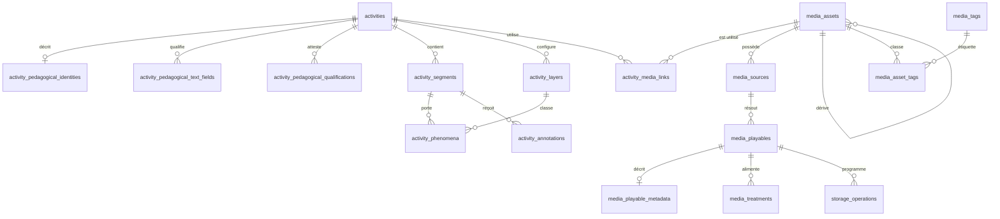

# Mission 127 — Proto05 — Brouillon du modèle relationnel MariaDB et contrat SQL

Date : 2026-07-26
Statut : conception soumise à validation de David
Version Proto05 : `0.1.45` — inchangée

## 1. Résultat

Cette mission propose :

- une base dédiée théorique `ic_proto05` ;
- un modèle relationnel séparant activité, identité pédagogique, asset média,
  source, playable, métadonnées techniques, traitement et dérivation ;
- un contrat de 41 procédures stockées `sp_` ;
- des politiques explicites de suppression logique et de retrait physique ;
- une file transactionnelle `storage_operations` pour coordonner la base et le
  disque sans prétendre que MariaDB supprime elle-même un fichier ;
- une stratégie indicative de migration des JSON, sans sélection de snapshot ni
  exécution.

Le brouillon SQL autonome est :

`prototypes/05-augmented-ic-video-01/database/drafts/001_proto05_schema_draft.sql`

Il n'a pas été exécuté. Aucune base, table ou donnée MariaDB n'a été créée ou
modifiée.

## 2. État initial

État relevé avant écriture :

- branche : `main` ;
- dernier commit :
  `5b19fce1814a440346a4ddd4705fe35b8aba4d47` —
  `docs(proto05): inspect storage before MariaDB design` ;
- `git status --short` : vide ;
- version applicative relevée dans
  `prototypes/05-augmented-ic-video-01/server/package.json` : `0.1.45`.

Le numéro de rapport maximal était `126`. L'absence de collision avec `127` a
été vérifiée avant création.

## 3. Sources inspectées

### Rapports lus intégralement

- `reports/126_proto05_storage_inspection_before_mariadb.md` ;
- `reports/098_proto05_media_library_model_specification.md` — nom réel du
  rapport 098 mentionné de façon abrégée dans la mission ;
- `reports/125_proto05_activity_library.md`.

### Code et données inspectés

- `prototypes/05-augmented-ic-video-01/server/server.js` ;
- `prototypes/05-augmented-ic-video-01/server/library-contract.js` ;
- `prototypes/05-augmented-ic-video-01/server/media-contract.js` ;
- `prototypes/05-augmented-ic-video-01/server/media-library-schema.js` ;
- `prototypes/05-augmented-ic-video-01/server/media-library-runtime.js` ;
- `prototypes/05-augmented-ic-video-01/server/pedagogical-identity.js` ;
- `prototypes/05-augmented-ic-video-01/shared/activity-library.js` ;
- `prototypes/05-augmented-ic-video-01/shared/teacher-video-library.js` ;
- les structures présentes dans `activities.json`, `activity-library.json`,
  `video-library.json`, `video-catalog.json` et les registres de traitements,
  en lecture seule.

Conformément à l'instruction de David, les entrées historiques supplémentaires
et playables indisponibles ont été considérés comme un état de développement
normal. Aucune enquête d'attribution n'a été menée et aucune sélection de
snapshot canonique n'a été faite.

### Conventions SQL inspectées

- `prototypes/08-dico-seven-sieves/database/current_draft/00_schema.sql` ;
- `prototypes/08-dico-seven-sieves/database/current_draft/10_procedures.sql` ;
- `prototypes/00-ic-hub/server/db/schema.sql` ;
- `prototypes/00-ic-hub/server/db/procedures.sql`.

Conventions retenues : une base par composant, nom `ic_*`, moteur InnoDB,
`utf8mb4_unicode_ci`, procédures `sp_`, transactions et gestionnaire
`SQLEXCEPTION` pour les mutations multi-tables, `SIGNAL SQLSTATE '45000'` pour
les violations métier. Le nom `ic_proto05` est donc cohérent avec `ic_dico` et
`ic_hub`.

## 4. Besoins réels et accès futurs

| Besoin | Données lues | Écritures | Filtres, tri, relations | Résultat attendu |
|---|---|---|---|---|
| Bibliothèque d'activités | activité, dossier, résumé pédagogique, média principal | aucune | texte, statut, complétude, dossier ; titre/date | lignes de cartes, statut, complétude, disponibilité média |
| Fiche activité | métadonnées, identité, graphe auteur, média | aucune | identifiant actif | plusieurs jeux structurés reconstruisant le contrat courant |
| Créer/modifier une activité | activité, identité minimale | activité et identité | unicité d'ID, titre, révision attendue | activité et nouvelle révision |
| Dupliquer une activité | activité et tous ses enfants | copie transactionnelle du graphe | remappage par portée d'activité, lignée pédagogique, qualifications remises à zéro | nouvelle activité brouillon |
| Supprimer une activité | activité et variantes | suppression logique | refus si variante pédagogique active | état `deleted`, révision, date |
| Classer une activité | activité, dossier | `folder_id` | dossier existant ou `NULL` | affectation courante |
| Vidéothèque | asset, dossier, tags, source, playable par défaut | aucune | texte, type de source, disponibilité, dossier, tag ; titre/date/disponibilité | cartes média et compteurs |
| Fiche média | asset, sources, playables, technique, tags, usages | aucune | asset actif | jeux structurés de détail |
| Importer un média | entrée validée et résultat de copie éventuel | asset, source, playable, technique | unicité des IDs et de la localisation disque | identité et playable créé |
| Disponibilité | playable et contrôle applicatif du disque/réseau | état et raison | playable non retiré | état actuel horodaté |
| Traitement/dérivation | source playable, job, paramètres, sortie | traitement puis asset/source/playable dérivé | source disponible, état de transition, même famille | traitement et résultat publiable |
| Associer un média | activité, asset, playable | lien principal | playable du bon asset, actif et disponible | association stable |
| Retirer/supprimer un média | usages, enfants, traitements, fichiers | état logique puis outbox disque | refus des dépendances actives | plan/état logique et opérations disque distinctes |
| Dossiers et tags | dossiers, affectations, tags | création/renommage/suppression/classification | nom normalisé unique ; dossier supprimé sans contenu | entité ou compte des éléments déclassés |
| Vue étudiante | activité publiée, playable disponible, segments, couches apprenant, phénomènes, overlays | aucune | activité publiée seulement | bundle sans données réservées à l'auteur |
| Atelier auteur | activité complète et tous ses enfants | sauvegarde atomique avec révision | cohérence des références locales | jeux de résultats complets |

Les recherches actuelles sont locales dans les interfaces. Le contrat proposé
les déplace côté SQL avec pagination `LIMIT/OFFSET`. Il ne prétend pas optimiser
un volume massif ; les index suivent les filtres constatés.

## 5. Découpage média canonique

| Concept | Sens | Exemple d'évolution |
|---|---|---|
| `media_assets` | identité métier stable d'une ressource | reste présente si un fichier disparaît |
| `media_sources` | origine déclarée ou obtenue | URL directe, HLS, YouTube, fichier importé, sortie dérivée |
| `media_playables` | représentation effectivement résoluble par le lecteur | fichier local, URL, manifeste HLS, embed |
| `media_playable_metadata` | constat technique sur un playable | durée, taille, codecs, empreinte |
| `media_treatments` | opération et audit de transformation | anonymisation, préparation, dérivation |
| asset dérivé | nouvel asset avec `parent_asset_id` et `family_root_asset_id` | sortie d'anonymisation conservant sa propre identité |
| disponibilité | état opérationnel du playable | `available`, `missing-local`, `unreachable-remote`, etc. |

Un fichier absent change la disponibilité du playable ; il ne détruit ni
l'asset, ni sa source, ni son historique de traitement.

## 6. Modèle relationnel

Les identifiants actuels sont conservables sous forme de `VARCHAR`. Les entités
internes d'une activité utilisent une clé composée `(activity_id, id)` :
l'identifiant local n'a pas besoin d'être global, et une duplication peut
préserver un graphe cohérent dans la nouvelle portée.

### Diagramme ER simplifié



### Tables d'infrastructure et de classement

| Table | Responsabilité et origine | PK, colonnes, relations | Unicité, nullabilité, index | Suppression |
|---|---|---|---|---|
| `schema_migrations` | journal futur des migrations, convention des autres composants | PK `version`, `description`, `checksum`, `applied_at` | checksum obligatoire | jamais en cascade |
| `import_runs` | audit d'une future migration/import JSON | PK `id`, type, snapshot, compteurs, rapport JSON, dates | rapport JSON nullable et validé | conservation d'audit |
| `languages` | catalogue partagé actuellement exposé par `/language-catalog` | PK `id`, code, libellé | code unique, index libellé | `RESTRICT` si utilisée |
| `activity_folders` | dossiers plats de la bibliothèque d'activités | PK `id`, nom, nom normalisé, dates | nom normalisé unique et non vide | procédure : activités déclassées puis dossier supprimé |
| `media_folders` | dossiers média, parent optionnel pour évolution | PK `id`, `parent_id`, nom | unicité normalisée par parent, index parent ; parent nullable | `RESTRICT` sur sous-dossier ; assets déclassés puis suppression |
| `media_tags` | tags média courants | PK `id`, nom, nom normalisé | nom normalisé unique | associations en cascade, pas assets |

### Activités et identité pédagogique

| Table | Responsabilité et origine | PK, colonnes, relations | Unicité, nullabilité, index | Suppression |
|---|---|---|---|---|
| `activities` | identité, métadonnées, statut et révision ; `activities.json` | PK `id`; FK dossier ; version, titre, textes, statut, révision, visibilité, dates | titre requis ; index bibliothèque, date | logique ; enfants conservés tant que la ligne existe |
| `activity_pedagogical_identities` | noyau canonique fréquent : nature, durée, intention, public, contexte, lignée ; `pedagogicalIdentity` | PK/FK `activity_id`; FK parent/racine d'activité ; états, notes, JSON d'extension explicite | une identité par activité ; contraintes d'états et lignée ; index racine/parent | enfant d'activité en `CASCADE` physique, lignée en `RESTRICT` |
| `activity_pedagogical_text_fields` | champs qualifiés restants : objectifs, prérequis, modalités, scénario, noyau, adaptable, origine, responsabilité, limites | PK `(activity_id, field_key)` ; état, valeur, note | clés et états fermés ; index champ/état | `CASCADE` avec activité lors d'une purge DBA future |
| `activity_pedagogical_qualifications` | attestations historisées du tableau `qualifications` | PK `(activity_id,id)` ; niveau, validateur, date, contexte, preuve | niveaux/types fermés ; index niveau/date | `CASCADE` avec activité ; non copiées lors d'une duplication |

### Graphe auteur

| Table | Responsabilité et origine | PK, colonnes, relations | Unicité, nullabilité, index | Suppression |
|---|---|---|---|---|
| `activity_languages` | langues sélectionnées par activité | PK `(activity_id,language_id)` ; FK activité/langue | libellé local nullable, ordre | `CASCADE` activité ; langue `RESTRICT` |
| `activity_transcriptions` | identité et langue de la transcription unique actuelle | PK/FK `activity_id`; ID local, langue, libellé ; les `segmentIds` sont la collection ordonnée des segments | un enregistrement par activité ; langue nullable si inconnue | `CASCADE` activité ; langue d'activité `RESTRICT` |
| `activity_speakers` | locuteurs locaux | PK `(activity_id,id)`, libellé, ordre | libellé requis | `CASCADE` activité ; références de segments `RESTRICT` |
| `activity_segments` | transcription segmentée | PK `(activity_id,id)`, début/fin/texte/ordre | fin > début ; index chronologique | `CASCADE` activité et tables de liaison |
| `activity_segment_speakers` | N–N segment-locuteur | PK triple ; deux FK composées | toutes colonnes requises | segment `CASCADE`, locuteur `RESTRICT` |
| `activity_segment_languages` | N–N segment-langue | PK triple ; deux FK composées | toutes colonnes requises | segment `CASCADE`, langue `RESTRICT` |
| `activity_language_intervals` | intervalles linguistiques fins | PK `(activity_id,id)` ; FK segment/langue | fin > début, index chronologique | activité `CASCADE`, références `RESTRICT` |
| `activity_layers` | couches d'analyse | PK `(activity_id,id)`, libellé, description, couleur | libellé requis | activité `CASCADE`, usages `RESTRICT` |
| `activity_layer_visibility` | visibilité par couche et audience | PK `(activity_id,layer_id,audience)` | audience apprenant/enseignant | `CASCADE` avec couche |
| `activity_phenomena` | phénomène temporel rattaché à segment et couche | PK `(activity_id,id)` ; FK segment/couche | fin > début, index chronologique | activité `CASCADE`, références `RESTRICT` |
| `activity_annotations` | annotations enseignantes liées à un segment | PK `(activity_id,id)` ; note/question | contenus nullables | activité `CASCADE`, segment `RESTRICT` |
| `activity_overlays` | contenu temporel affichable, annotation optionnelle | PK `(activity_id,id)` ; FK annotation | annotation nullable, fin > début, index chronologique | activité `CASCADE`, annotation `RESTRICT` |
| `activity_overlay_layers` | N–N overlay-couche | PK triple ; FK composées | toutes colonnes requises | overlay `CASCADE`, couche `RESTRICT` |

Les `CASCADE` de ce groupe ne déclenchent pas la suppression fonctionnelle :
`sp_activity_delete` est logique. Elles servent uniquement à une purge
administrative future explicitement validée et garantissent qu'un agrégat
activité ne laisse pas d'enfants orphelins.

### Médias, traitements et disque

| Table | Responsabilité et origine | PK, colonnes, relations | Unicité, nullabilité, index | Suppression |
|---|---|---|---|---|
| `media_assets` | identité logique et lignée ; `video-library.assets` | PK `id`; FK dossier, parent, racine ; playable par défaut vérifié par FK composée | titre requis ; index bibliothèque/lignée | logique ; parent/racine/default en `RESTRICT` |
| `media_sources` | origine et provenance ; `sources` | PK `id`, FK asset ; type, fournisseur, transport, URL/JSON | asset/type indexés ; URL nullable selon type | `RESTRICT`, historique préservé |
| `media_playables` | représentation lisible et disponibilité ; `playables` | PK `id`; FK asset/source ; localisation disque/URL/embed, état/raison | `(asset_id,id)` unique ; empreinte SHA-256 générée unique de la clé disque ; index disponibilité | `RESTRICT`, retrait daté |
| `media_playable_metadata` | résultat d'analyse technique | PK/FK `playable_id`; durée, taille, empreinte, dimensions, codecs | valeurs inconnues nullables ; index SHA-256 | `CASCADE` avec purge d'un playable |
| `media_asset_tags` | N–N asset-tag | PK `(asset_id,tag_id)` | index inverse | `CASCADE` de l'association seulement |
| `media_treatments` | état persistant d'un job, paramètres, diagnostics, sortie | PK `id`; FK composées vers source/sortie ; statut, progrès, moteurs, JSON, dates | progrès 0–100, sortie requise si terminé ; index source/statut et sortie | toutes les références en `RESTRICT` |
| `activity_media_links` | association stable, actuellement `videoRef` | PK `(activity_id,role)` ; FK activité et playable de l'asset | un principal par activité ; index média/usages | `CASCADE` si purge activité ; média `RESTRICT` |
| `storage_operations` | outbox de retrait physique contrôlé | PK `id`; FK playable ; portée, clé, empreinte attendue, état, erreur | une demande ouverte par playable/type via colonne générée ; index file | historique conservé, playable `RESTRICT` |

La clé disque complète n'est pas indexée directement : `VARCHAR(768)` en
`utf8mb4` dépasserait facilement la taille d'index. Une empreinte générée
SHA-256 de `(storage_scope, storage_key)` porte l'unicité ; une collision reste
théoriquement possible et doit être revue par le DBA.

## 7. Suppressions et effets disque

| Opération | Politique SQL | Procédure | Refus et résultat | Effet disque |
|---|---|---|---|---|
| Retirer seulement un fichier | demande outbox puis confirmation | `sp_storage_file_removal_request`, `..._complete`, `..._fail` | playable local non-default ou asset déjà supprimé, aucun usage ni traitement actif ; retourne opération | le serveur vérifie portée, clé et empreinte, supprime, puis confirme |
| Rendre un playable indisponible | mise à jour d'état, aucune suppression | `sp_media_update_playable_availability` | playable existant non retiré | aucun |
| Supprimer une dérivation | asset dérivé marqué `deleted` | `sp_media_derivation_delete` | refus si activité ou enfant actif | fichiers conservés jusqu'à demandes outbox |
| Supprimer une fiche média | asset marqué `deleted` | `sp_media_asset_delete` | refus si activité ou dérivation active | aucun retrait implicite |
| Supprimer une lignée | tous les assets de la famille marqués `deleted` dans une transaction | `sp_media_lineage_delete` | refus si usage d'activité ou traitement actif | retraits programmés ensuite, playable par playable |
| Supprimer une activité | statut et `deleted_at` | `sp_activity_delete` | conflit de révision ou variante pédagogique active | aucun |
| Supprimer un dossier | contenu déclassé, dossier supprimé | `sp_activity_folder_delete`, `sp_media_folder_delete` | sous-dossier média actif : `RESTRICT` | aucun |
| Supprimer un tag | association seulement en cascade | `sp_media_tag_delete` | retourne le nombre d'assets détagués ; aucun asset supprimé | aucun |

Une réponse de suppression doit distinguer : état logique obtenu, conflits
éventuels, nombre d'éléments déclassés et liste des opérations physiques encore
à exécuter. « Supprimé du catalogue » ne doit plus signifier implicitement
« fichier effacé ».

## 8. Lectures structurantes

| Lecture | Tables et forme | Filtres / ordre / pagination | Contrat |
|---|---|---|---|
| Bibliothèque activités | activité + dossier + identité + lien/playable principal | texte, statut, complétude, dossier ; titre/date ; `LIMIT/OFFSET` | `sp_activity_library_search`, une ligne par activité |
| Vidéothèque | asset + dossier + default playable + sources + tags | texte, type, disponibilité, dossier, tag ; titre/date/état ; pagination | `sp_media_library_search`, une ligne agrégée par asset |
| Fiche activité | en-tête puis jeux de résultats de chaque collection | ID actif, ordre métier/chronologique | `sp_activity_get` |
| Fiche média | asset, sources, playables+technique, tags, usages | ID actif | `sp_media_get` |
| Lignée média | famille racine, parent, disponibilité par défaut | ID d'un membre ; ordre de création | `sp_media_lineage_get` |
| Traitements | traitements source/sortie | asset, statut, plus récent, pagination | `sp_media_treatments_search` |
| Vue étudiante | activité publiée + playable disponible + segments/couches apprenant/phénomènes/overlays | ID publié ; chronologique | `sp_student_activity_bundle` |
| Atelier auteur | tous les jeux de la fiche, y compris pédagogique et configuration | ID actif | `sp_author_activity_bundle` déléguant au contrat de fiche |

Les procédures de fiche apportent un contrat multi-jeux stable. Elles ne sont
pas de simples enveloppes cosmétiques d'un unique `SELECT`.

## 9. Contrat des procédures stockées

### Activités, pédagogie et classement

| Procédure | Entrées / résultat | Tables, transaction et règles |
|---|---|---|
| `sp_activity_create` | ID, version, titre et textes → activité créée | `activities`, identité minimale ; unicité et titre ; mutation courte |
| `sp_activity_update_metadata` | ID, révision attendue, statut/textes → nouvelle révision | `activities` ; verrou optimiste ; erreur introuvable/conflit |
| `sp_activity_duplicate` | source, nouvel ID/titre, conservation dossier → copie | toutes tables de l'agrégat + lien média ; transaction ; brouillon, lignée variante, qualifications remises à zéro |
| `sp_activity_delete` | ID, révision → état supprimé | `activities` + contrôle lignée ; logique ; refuse variantes actives |
| `sp_activity_set_pedagogical_identity` | noyau, états, notes, lignée, JSON explicite → identité et complétude | identité + activité ; transaction ; parent/racine présents et forme cohérente |
| `sp_activity_replace_pedagogical_details` | révision, champs et qualifications JSON → révision | tables textuelles/qualifications ; remplacement transactionnel et contraintes de domaine |
| `sp_activity_replace_authoring` | révision + graphe JSON normalisé → révision | toutes tables du graphe ; transaction ; FK et intervalles garantissent la cohérence |
| `sp_activity_set_primary_media` | activité, asset, playable → lien | lien + activité ; transaction ; playable actif, du bon asset et disponible |
| `sp_activity_folder_create` | ID, nom → dossier | dossier ; nom normalisé unique |
| `sp_activity_folder_rename` | ID, nom → dossier | dossier ; verrou et unicité |
| `sp_activity_folder_delete` | ID → ID + nombre déclassé | activité+dossier ; transaction ; contenu mis à `NULL` |
| `sp_activity_assign_folder` | activité, dossier nullable → affectation | activité+dossier ; classement/déclassement, existence contrôlée |
| `sp_activity_library_search` | recherche/filtres/tri/page → cartes | lecture structurante ; index bibliothèque |
| `sp_activity_get` | ID → jeux de résultats complets | lecture de l'agrégat auteur |
| `sp_student_activity_bundle` | ID → bundle étudiant | exige activité publiée et playable disponible |
| `sp_author_activity_bundle` | ID → bundle auteur | contrat stable délégué à `sp_activity_get` |

### Médias, traitements et stockage

| Procédure | Entrées / résultat | Tables, transaction et règles |
|---|---|---|
| `sp_media_folder_create` | ID, parent, nom → dossier | dossier ; transaction si parent ; unicité par parent |
| `sp_media_folder_rename` | ID, nom → dossier | dossier ; verrou et unicité |
| `sp_media_folder_delete` | ID → nombre déclassé | asset+dossier ; transaction ; sous-dossiers interdits |
| `sp_media_asset_assign_folder` | asset, dossier nullable → affectation | asset+dossier ; classement/déclassement |
| `sp_media_tag_create` | ID, nom → tag | tag ; normalisation et unicité |
| `sp_media_tag_rename` | ID, nom → tag | tag ; normalisation et unicité |
| `sp_media_tag_delete` | ID → compte détagué | tag+liaisons ; transaction ; aucun asset supprimé |
| `sp_media_asset_set_tags` | asset, tableau JSON d'IDs → tags | liaison+tags ; transaction ; IDs inconnus refusés |
| `sp_media_register_import` | IDs, titre, origine/localisation/provenance → triplet créé | asset+source+playable+technique ; transaction ; playable par défaut |
| `sp_media_register_playable` | playable, asset/source, localisation, défaut éventuel → playable | source+playable+technique+asset ; transaction ; appartenance source/asset |
| `sp_media_update_playable_availability` | playable, état, raison → état | playable ; états fermés ; non retiré |
| `sp_media_set_playable_metadata` | playable, analyse, durée/taille/empreinte/codecs → métadonnées | playable+technique ; upsert contrôlé, playable non retiré |
| `sp_media_treatment_start` | traitement, source, type, job/moteur/paramètres → traitement | traitement ; source disponible |
| `sp_media_treatment_update` | ID, état, progrès, diagnostics/erreur → traitement | traitement ; transition depuis état mutable |
| `sp_media_treatment_complete` | traitement + IDs/localisation/métadonnées sortie → résultat | traitement+asset/source/playable dérivé+technique ; transaction ; même famille, sortie atomique |
| `sp_media_derivation_delete` | asset dérivé → état | délègue la suppression contrôlée ; refuse une racine |
| `sp_media_asset_delete` | asset → état logique | usages et enfants contrôlés ; transaction |
| `sp_media_lineage_delete` | racine → membres supprimés logiquement | famille, activités, traitements ; transaction ; dépendances actives refusées |
| `sp_storage_file_removal_request` | opération, playable → demande | playable+asset+usages+traitements+outbox ; transaction ; non-default ou asset déjà supprimé |
| `sp_storage_file_removal_complete` | opération → confirmation | outbox+playable ; transaction ; `removed_at` seulement après succès disque |
| `sp_storage_file_removal_fail` | opération, erreur → échec | outbox ; conserve playable et localisation |
| `sp_media_library_search` | recherche/filtres/tri/page → cartes | lecture agrégée asset/source/playable/tag |
| `sp_media_get` | asset → jeux de détail | fiche, technique, tags, usages |
| `sp_media_lineage_get` | membre → famille | lecture structurante de parent/racine |
| `sp_media_treatments_search` | asset/statut/page → traitements | source ou sortie, ordre récent |

Erreurs prévues : identifiant dupliqué, entité absente, conflit de révision,
référence hors agrégat, JSON invalide, état de transition interdit, playable
indisponible, dépendance active, lignée incohérente et demande disque non
ouverte. Les numéros `MYSQL_ERRNO` du brouillon sont provisoires et doivent être
réservés globalement avant implémentation.

## 10. Correspondance routes actuelles → SQL futur

| Route ou famille actuelle | Accès futur principal |
|---|---|
| `GET /api/proto05/activity-library` | `sp_activity_library_search` + listes de dossiers |
| `/api/proto05/activity-library/folders...` | procédures `sp_activity_folder_*` |
| `PUT .../activities/:id/classification` | `sp_activity_assign_folder` |
| `GET/POST /api/proto05/activities` | `sp_activity_library_search` ou `sp_activity_create` |
| `GET/PUT/DELETE /api/proto05/activities/:id` | `sp_activity_get`, `sp_activity_update_metadata`, `sp_activity_delete` |
| `POST /api/proto05/activities/:id/duplicate` | `sp_activity_duplicate` |
| `PUT /api/proto05/activities/:id/authoring` | `sp_activity_replace_authoring` et procédures pédagogiques dans une transaction applicative à préciser |
| `PUT /api/proto05/activities/:id/video-ref` | `sp_activity_set_primary_media` |
| `GET .../:id/video-resolution` | lecture du lien + playable actif |
| `GET /api/proto05/language-catalog` | `SELECT` simple sur `languages` |
| `GET /api/proto05/library/assets` | `sp_media_library_search` |
| `POST /api/proto05/library/assets` et `.../import-local` | `sp_media_register_import` |
| `GET /api/proto05/library/assets/:id` | `sp_media_get` |
| `/api/proto05/library/folders...` | procédures `sp_media_folder_*` |
| `/api/proto05/library/tags...` et classification asset | `sp_media_tag_create`, `sp_media_tag_rename`, `sp_media_tag_delete`, `sp_media_asset_set_tags`, `sp_media_asset_assign_folder` |
| `GET /api/proto05/library/playables/:id` | lecture playable + métadonnées |
| imports/copies distants | validation/copie côté Node puis `sp_media_register_playable` ou `sp_media_register_import` |
| préparations/téléchargements/dérivations HLS | job runtime côté Node, persistance par `sp_media_treatment_*` |
| suppression copie locale | outbox `sp_storage_file_removal_*` |
| suppression dérivation/asset/physical | `sp_media_derivation_delete`, `sp_media_asset_delete`, puis outbox |
| route `/student/:id` et résolution associée | `sp_student_activity_bundle` |

Le serveur Node garde les responsabilités qu'une base ne peut pas assumer :
validation de chemin, réseau, copie, empreinte réelle, FFmpeg, lecture du disque
et projection HTTP. Il ne doit pas reconstruire en mémoire une seconde source
de vérité ni retomber silencieusement sur les JSON.

## 11. Décisions solides

- base dédiée `ic_proto05` dans l'instance commune ;
- InnoDB, `utf8mb4_unicode_ci`, procédures `sp_` ;
- MariaDB seule source de vérité applicative après migration ;
- binaires hors base ;
- séparation asset/source/playable/technique/traitement ;
- lignée matérialisée par parent et racine ;
- disponibilité portée par le playable ;
- fichiers absents conservant l'identité métier ;
- dossier direct nullable pour une activité et un asset, car le besoin actuel
  n'est pas multi-dossiers ;
- tags média N–N ;
- identifiants locaux d'auteur portés par l'activité ;
- suppression fonctionnelle logique ;
- suppression disque en deux temps, jamais couplée implicitement au `COMMIT` ;
- verrou optimiste `authoring_revision` sur les sauvegardes ;
- qualifications non héritées lors d'une duplication.

## 12. Décisions ouvertes pour David et revue DBA

1. Collation : conserver `utf8mb4_unicode_ci` pour homogénéité ou adopter une
   collation MariaDB plus récente lors d'une évolution coordonnée de tout
   IC-Lab-Next.
2. Recherche : `LIKE` suffit au prototype ; décider ultérieurement si un
   `FULLTEXT` français est utile.
3. Dossiers média : le modèle autorise une hiérarchie ; confirmer si l'interface
   doit rester plate. Une suppression de parent est actuellement refusée.
4. Extensions pédagogiques : `extended_fields_json` n'est pas un fallback. Il
   faut décider quelles futures clés deviennent des colonnes/tables avant leur
   usage métier.
5. Transaction auteur : choisir entre un seul grand contrat JSON ou une
   transaction applicative appelant identité, détails et graphe avec une même
   révision. Le brouillon expose les deux ensembles séparément.
6. Retour des procédures : confirmer la capacité du connecteur Node à consommer
   proprement plusieurs jeux de résultats.
7. Pagination : plafonds de `LIMIT`, convention de curseur éventuelle et compte
   total séparé.
8. Normalisation des noms : la colonne normalisée est calculée par l'appelant ;
   confirmer une fonction SQL canonique ou une collation/colonne générée.
9. Identifiants : conserver les IDs textuels existants ou générer de nouveaux
   UUID/ULID uniquement pour les nouvelles entités.
10. Empreinte de clé disque : accepter le risque théorique SHA-256 ou ajouter une
    vérification applicative de la chaîne complète lors d'un conflit.
11. États de traitement : aligner définitivement les libellés runtime français
    historiques sur les états SQL anglais.
12. Rétention : durée de conservation des lignes logiquement supprimées, des
    traitements et des opérations disque.
13. Permissions : créer plus tard un utilisateur applicatif limité à
    `EXECUTE`/lectures nécessaires, sans credentials dans le dépôt.
14. Nommage des erreurs : réserver une plage `MYSQL_ERRNO` commune aux
    composants.

## 13. Risques et points de vigilance

- Le SQL est un brouillon monolithique de revue, pas une migration rejouable.
- `CREATE DATABASE IF NOT EXISTS` est intentionnellement présent mais n'a pas été
  exécuté ; l'installation réelle devra être scindée et approuvée.
- Les contraintes `CHECK`, colonnes générées et `JSON_TABLE` ciblent MariaDB
  moderne ; leur syntaxe exacte doit être validée sur la version Docker réelle
  dans une base jetable, après accord.
- L'atomicité SQL ne couvre pas le disque. L'outbox réduit le risque mais exige
  un worker idempotent, une vérification d'empreinte et une reprise après panne.
- Un hash de contenu identique ne prouve pas une même identité métier ; il ne
  doit pas fusionner automatiquement des assets.
- Les appels de traitement ne doivent pas maintenir uniquement un registre en
  mémoire : les transitions durables doivent être persistées.
- Les clés étrangères protègent la cohérence, mais les suppressions logiques
  exigent aussi que toutes les lectures filtrent `deleted_at`.
- Une duplication conserve les IDs enfants dans une nouvelle portée SQL, alors
  que le JSON actuel les remappe globalement. Le futur adaptateur HTTP devra
  confirmer que le contrat client n'exige pas leur unicité globale.
- Les entrées historiques à ne pas conserver seront choisies avec David dans un
  snapshot distinct ; ce rapport ne les qualifie pas.

## 14. Stratégie indicative de migration — non exécutée

1. David sélectionne et fige un snapshot JSON canonique ainsi que la politique
   de conservation des anciennes fiches.
2. Copier ce snapshot dans un espace de migration en lecture seule et calculer
   les empreintes des fichiers, sans modifier les originaux.
3. Créer une base temporaire jetable sur la même version MariaDB, uniquement
   après validation humaine du plan, de la sauvegarde et du retour arrière.
4. Insérer `languages`, dossiers et tags.
5. Insérer les activités, leur identité pédagogique et leur lignée ; conserver
   les IDs actuels lorsqu'ils sont uniques et valides.
6. Insérer locuteurs, segments, langues d'activité, liaisons, intervalles,
   couches, phénomènes, annotations et overlays dans l'ordre des FK.
7. Insérer assets, puis compléter parent/racine, sources, playables,
   métadonnées, tags et traitements.
8. Transformer `videoRef` en `activity_media_links`. Pour les références
   historiques ambiguës, produire une anomalie explicite ; aucun fallback.
9. Pour un fichier absent, importer l'asset/source/playable avec disponibilité
   `missing-local` et conserver sa localisation historique. Ne pas supprimer la
   fiche par effet de bord.
10. Pour une fiche exclue par David, l'omettre du snapshot d'import avec une
    trace dans `import_runs`, sans la supprimer des archives originales.
11. Valider types, bornes temporelles, intervalles, IDs, FK, cycles de lignée,
    playables par défaut et unicité de localisation.
12. Faire une migration à blanc répétable, comparer avant/après : nombres par
    entité, IDs, relations, disponibilités, familles, usages et sommes de
    fichiers.
13. Tester un export de reconstruction et un échantillon de bundles
    auteur/étudiant dans la base jetable.
14. En cas d'écart, abandonner la base temporaire ; aucun basculement partiel.
15. Le basculement futur devra être atomique au niveau configuration, sans
    fallback JSON silencieux, avec sauvegarde et procédure de retour arrière
    approuvées.

Une seule transaction géante n'est pas nécessairement appropriée pour les
binaires. Le chargement SQL peut être transactionnel par agrégat/import, avec
validation globale avant bascule.

## 15. Fichiers créés

- `reports/127_proto05_mariadb_model_draft.md` ;
- `prototypes/05-augmented-ic-video-01/database/drafts/001_proto05_schema_draft.sql`.

Aucun fichier applicatif, fichier de données, launcher, configuration Docker ou
version n'a été modifié.

## 16. Vérifications

Contrôles statiques prévus/réalisés à la fin de mission :

- présence du nom théorique `ic_proto05`, InnoDB, `utf8mb4` et collation ;
- inventaire des tables, procédures, PK, FK, index et délimiteurs ;
- correspondance `DROP PROCEDURE` / `CREATE PROCEDURE` ;
- détection de doublons de noms de contraintes et de procédures ;
- références de tables des FK présentes ;
- recherche de credentials ou d'instructions Docker ;
- contrôle des espaces avec `git diff --check` et contrôle équivalent des
  fichiers non suivis ;
- vérification de l'état Git final et de la version.

Résultats statiques :

- 31 `CREATE TABLE`, tous avec InnoDB ;
- 41 couples `DROP/CREATE PROCEDURE`, 41 `SQL SECURITY INVOKER` et 41 fins de
  procédure ;
- un couple de délimiteurs, 17 transactions et 17 `COMMIT` ;
- aucun doublon de table, procédure, contrainte ou numéro d'erreur ;
- aucune table étrangère référencée sans définition ;
- guillemets SQL et parenthèses équilibrés ;
- aucune espace finale détectée ; `git diff --check` sans diagnostic ;
- version relue : `0.1.45`.

Non vérifié, conformément à la mission :

- aucune exécution SQL ni validation par le moteur MariaDB ;
- aucune création de base ;
- aucune migration ou écriture de donnée ;
- aucun serveur, HTTP, Chromium, FFmpeg ou test applicatif ;
- aucune recette fonctionnelle ou validation humaine de David.

État Git final relevé :

```text
?? prototypes/05-augmented-ic-video-01/database/
?? reports/127_proto05_mariadb_model_draft.md
```

Ces deux entrées correspondent exclusivement aux deux livrables de la mission.

## 17. Version et suite

Version obtenue : `0.1.45`, inchangée. La mission est documentaire et de
conception.

Suite possible après arbitrage : revue DBA ligne à ligne, choix des décisions
ouvertes, découpage en migrations idempotentes, puis essai uniquement sur une
base jetable et un snapshot explicitement sélectionné.

Message de commit proposé, sans commit effectué :

`docs(proto05): draft MariaDB data model`
